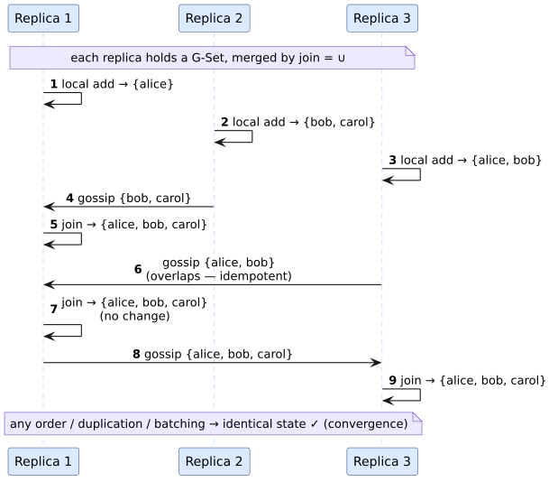

# llattice

**Lawful, layered lattice traits for Rust.** `llattice` provides a shared
vocabulary for join-semilattices, meet-semilattices, lattices, and
context-free bottom values, with an optimized in-place join for fixed-point and
dataflow engines.


## Why the API is layered

A **join-semilattice** has a join operation $`\vee`$ that is idempotent,
commutative, and associative. It induces the partial order
$`a \preceq b \iff a \vee b = b`$. A **meet-semilattice** dually has
$`\wedge`$. A **lattice** has both operations and the two absorption laws. A
**bottom** value $`\perp`$ is a context-free least element.

These are different capabilities, so version 0.2 models them as different
traits:


The editable source is
[`lattice-class.puml`](docs/design/figures/lattice-class.puml).

The separation matters in practice. An idempotent semiring supplies a lawful
join through addition, but multiplication is generally path composition, not
meet. A CRDT merge needs only join. Requiring a full lattice in either case
would invent structure the domain does not have.

## Quick start

```toml
[dependencies]
llattice = "0.2"
```

```rust
use llattice::{Bottom, JoinSemilattice, MeetSemilattice};
use std::collections::HashSet;

let mut known: HashSet<u32> = Bottom::bottom();

// The first update adds information.
assert!(known.join_assign(&[1, 2].into_iter().collect()));
// Replaying old information is an exact no-op.
assert!(!known.join_assign(&[1].into_iter().collect()));

assert!(known.leq(&[1, 2, 3].into_iter().collect()));
assert_eq!(known.join(&[2, 3].into_iter().collect()),
           [1, 2, 3].into_iter().collect());
assert_eq!(known.meet(&[2, 3].into_iter().collect()),
           [2].into_iter().collect());
```

Import `llattice::prelude::*` when an algorithm uses all four traits. Importing
only the marker `Lattice` does not place its supertraits' methods into concrete
method-call scope; import `JoinSemilattice` and `MeetSemilattice` explicitly.

The default `std` feature adds the `HashSet` implementations. Disable default
features for a dependency-free `no_std` core containing the traits, integer and
Boolean implementations, `Option` lift, and law harness:

```toml
[dependencies]
llattice = { version = "0.2", default-features = false }
```

## The contracts

For all values $`a`$, $`b`$, and $`c`$, a lawful join satisfies:

| Law | Equation |
|---|---|
| Idempotency | $`a \vee a = a`$ |
| Commutativity | $`a \vee b = b \vee a`$ |
| Associativity | $`(a \vee b) \vee c = a \vee (b \vee c)`$ |

Meet satisfies the dual equations. A `Lattice` additionally satisfies:

```math
a \vee (a \wedge b) = a
\qquad
a \wedge (a \vee b) = a
```

`join_assign` is a refinement of `join`, not a second algebra:

```math
\mathrm{after}(a.\mathrm{join\_assign}(b)) = a \vee b
```

Its Boolean result is `true` exactly when the stored value changed. This lets a
worklist engine enqueue dependents without cloning and comparing the whole
domain value a second time.

`Lattice` is an explicit marker. It is not blanket-implemented for every type
that implements both semilattices because two individually lawful operations
need not absorb one another. The Rocq countermodel uses Boolean OR for both
operations and disproves absorption.

## Built-in implementations

| Type | Join | Meet | `Bottom` | Notes |
|---|---|---|---|---|
| integer primitives | `max` | `min` | `MIN` | inline, constant time |
| `bool` | logical OR | logical AND | `false` | two-element lattice |
| `Option<T>` | lifted join | lifted meet | `None` | preserves only capabilities supplied by `T` |
| `HashSet<T, S>` | union | intersection | empty set when `S: Default` | generic over cloneable hash builders |

`HashSet::join` clones the larger table and extends it with the smaller table.
`meet` scans the smaller operand. `join_assign` reuses the accumulator's table.
All collection work is iterative, expected $`\Theta(n + m)`$ for join and
expected $`\Theta(\min(n,m))`$ for meet with a well-behaved hasher.

There are deliberately no raw float or sequence implementations:

- `f32` and `f64` contain `NaN`, which is unequal to itself and incomparable
  under `partial_cmp`; a max/min implementation cannot satisfy the structural
  laws. Use a validated no-`NaN` newtype and implement the traits there.
- `Vec<T>` has structural, order-sensitive equality. A left-biased
  order-preserving union is not commutative as a `Vec` value. Use `HashSet`, a
  canonicalized wrapper, or a domain type with an explicit quotient relation.

Removing conditionally lawful instances is intentional: the trait bound now
means the algebraic contract without hidden preconditions.

## Implementing a domain

```rust
use llattice::{Bottom, JoinSemilattice, Lattice, MeetSemilattice};

#[derive(Clone, Debug, PartialEq)]
struct Version(u64);

impl JoinSemilattice for Version {
    fn join_assign(&mut self, other: &Self) -> bool {
        if self.0 < other.0 {
            self.0 = other.0;
            true
        } else {
            false
        }
    }

    fn leq(&self, other: &Self) -> bool {
        self.0 <= other.0
    }
}

impl MeetSemilattice for Version {
    fn meet(&self, other: &Self) -> Self {
        Version(self.0.min(other.0))
    }
}

impl Lattice for Version {}

impl Bottom for Version {
    fn bottom() -> Self {
        Version(0)
    }
}

assert_eq!(Version(3).join(&Version(7)), Version(7));
```

Use the reusable harness in exhaustive or property-based tests:

```rust
use llattice::laws;

# use llattice::{Bottom, JoinSemilattice, Lattice, MeetSemilattice};
# #[derive(Clone, Debug, PartialEq)] struct Version(u64);
# impl JoinSemilattice for Version {
#   fn join_assign(&mut self, other: &Self) -> bool {
#     let changed = self.0 < other.0; self.0 = self.0.max(other.0); changed
#   }
# }
# impl MeetSemilattice for Version { fn meet(&self, other: &Self) -> Self { Version(self.0.min(other.0)) } }
# impl Lattice for Version {}
# impl Bottom for Version { fn bottom() -> Self { Version(0) } }
laws::check_lattice(&Version(1), &Version(4), &Version(2))
    .expect("Version satisfies the lattice laws");
laws::check_bottom(&Version(4)).expect("Version has a lawful bottom");
```

The harness identifies the first failed law. It checks samples; it does not
replace exhaustive reasoning or formal proof over the whole domain.

### Julia and Raku

The repository also contains natural Julia and Raku packages. They implement
the same lattice laws and can expose customer-defined values through the shared
Vinary Tree resource ABI without adding an FFI dependency to the Rust crate.

```julia
using LLattice
@assert join(MaxMin(3), MaxMin(8)) == MaxMin(8)
@assert validate_laws(MaxMin.([1, 2, 3]))
```

```raku
use LLattice;
my $left = FiniteSetLattice.new(value => set(<read write>));
my $right = FiniteSetLattice.new(value => set(<write admin>));
say $left.join($right).value;
```

See the [foreign-language architecture and usage guides](docs/bindings/README.md)
for installation, custom providers, stable encodings, ownership, threading,
security, and bounded batch operations.

## Use cases

### CRDT-style merges and state-based replication

A **join-semilattice** is the algebraic backbone of a state-based convergent
replicated data type (CvRDT). Each replica holds a value from a
join-semilattice, and two replica states merge with join. Idempotency,
commutativity, and associativity ensure that replicas which observe the same
updates converge independently of order, duplication, or batching.



## Parallelism, concurrency, and stack safety

`Send` and `Sync` are not algebraic laws. A single-threaded optimizer may use an
`Rc`-backed domain, while a parallel work-stealing engine needs
`T: JoinSemilattice + Send + Sync`. The engine owns that scheduling decision and
adds the bounds where state crosses workers.

No built-in operation grows the native call stack with input depth. Scalars are
constant-depth; `Option` delegates through its statically known type layer; set
operations use iterative standard-library loops and heap-resident tables. The
formal model proves that the corresponding explicit-worklist transition
strictly decreases its pending-element measure, and a test executes a
150,000-element merge on a 64 KiB native stack.

A specialized pushdown automaton is appropriate when the *semantics* are
pushdown-shaped—parsing, nested matching, or recursive tree languages. Flat
lattice union/intersection is not pushdown-shaped, so an iterative set machine
is both simpler and faster here.

## Category-theoretic role

In the wider vinary-tree optimization campaign, a domain's join is a canonical
way to combine compatible information, and monotone maps between domains are
the relevant morphisms. `llattice` supplies the algebraic objects and laws;
`libmorphism` describes typed transformations and evidence; `lling-llang` owns
the optimization plan, provenance, and legality checks. Keeping the leaf crate
small prevents orchestration policy from contaminating the domain algebra.

## Documentation and verification

The [documentation index](docs/README.md) links theory, architecture, API
semantics, implementation guides, performance, security, and release material.
Formal and executable obligations are joined by
[`proofs/doc/lattice-invariants.tsv`](proofs/doc/lattice-invariants.tsv).

```bash
./proofs/verify.sh
cargo test --all-targets
cargo clippy --all-targets -- -D warnings
```

Rust's orphan rule means a trait can only be implemented for a foreign type by the crate that *defines the trait* or the crate that *defines the type*. If each member of the family declared its own `Lattice`, then `libdictenstein`'s `HashSet` lattice and `lling-llang`'s `HashSet` lattice would be **different, incompatible traits** — a value could not flow between them, and any crate depending on both would face a diamond. Extracting `Lattice` into a single zero-dependency leaf crate gives the whole family one canonical trait, one set of built-in impls, and one source of truth for what `join`/`meet` mean.

---

## Documentation

In-depth documentation lives under [**`docs/`**](docs/README.md) — a guideline-driven suite with theory,
design, guides, language bindings, and engineering tracks, plus 20 fully-coloured diagrams rendered from committed sources.

- **Theory** — [order theory](docs/theory/01-order-theory.md) · [lattices & the four laws](docs/theory/02-semilattices-lattices.md) · [lawfulness matrix & proofs](docs/theory/03-lawfulness-and-proofs.md) · [the semiring bridge](docs/theory/04-semiring-bridge.md)
- **Design** — [architecture](docs/design/01-architecture.md) · [the orphan rule](docs/design/02-orphan-rule.md) · [per-impl semantics](docs/design/03-semantics.md) · [ADRs](docs/design/adr/)
- **Guides** — [quickstart](docs/guides/01-quickstart.md) · [implementing `Lattice`](docs/guides/02-implementing-lattice.md) · [CRDT cookbook](docs/guides/03-crdt-cookbook.md) · [fixpoints & analysis](docs/guides/04-fixpoints-and-analysis.md)
- **Language bindings** — [architecture](docs/bindings/README.md) · [Julia](docs/bindings/julia.md) · [Raku](docs/bindings/raku.md) · [performance](docs/bindings/performance.md) · [capability matrix](docs/bindings/completeness-matrix.tsv)
- **Engineering** — [testing](docs/engineering/01-testing.md) · [performance](docs/engineering/02-performance.md) · [security](docs/engineering/03-security.md)
- **Reference** — [glossary](docs/GLOSSARY.md) · [diagram catalog](docs/diagrams/README.md) · [changelog](CHANGELOG.md)

Diagrams are rebuilt from their text sources with `make -C docs/diagrams` (Graphviz · D2 · PlantUML · TikZ).

The formal driver establishes its own `systemd-run` resource scope. Benchmark
and profiling artifacts belong under repository-local `target/`; do not place
them on memory-backed temporary filesystems.

## References

1. Birkhoff, G. *Lattice Theory*, 3rd ed. American Mathematical Society, 1967.
   [AMS Colloquium Publications 25](https://bookstore.ams.org/COLL/25); DOI:
   `10.1090/coll/025`.
2. Davey, B. A., and Priestley, H. A. *Introduction to Lattices and Order*, 2nd
   ed. Cambridge University Press, 2002.
   [https://doi.org/10.1017/CBO9780511809088](https://doi.org/10.1017/CBO9780511809088)
3. Shapiro, M., Preguiça, N., Baquero, C., and Zawirski, M. “Conflict-Free
   Replicated Data Types.” SSS 2011.
   [https://doi.org/10.1007/978-3-642-24550-3_29](https://doi.org/10.1007/978-3-642-24550-3_29)

## License

Apache-2.0. Minimum supported Rust version: 1.70.
