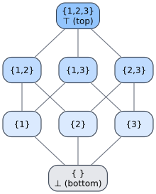

# llattice

**A dependency-free `Lattice` trait for Rust** — `join` (least upper bound) and `meet` (greatest lower bound) — with built-in implementations for integers, floats, `bool`, `Option`, `HashSet`, and `Vec`. One shared lattice vocabulary for the whole family.


[](https://crates.io/crates/llattice)
[](https://docs.rs/llattice)


---

## What is llattice?

A **lattice** is a partially-ordered set in which *every pair* of elements has both a least upper bound and a greatest lower bound. llattice distills that idea to its smallest useful form: a single trait with two methods.

- **`join`** — the *least upper bound* (supremum, `⊔`): the smallest element that is `≥` both inputs. For numbers, `max`; for sets, `∪` (union).
- **`meet`** — the *greatest lower bound* (infimum, `⊓`): the largest element that is `≤` both inputs. For numbers, `min`; for sets, `∩` (intersection).

```rust
use llattice::Lattice;

assert_eq!(5u32.join(&3), 5); // least upper bound = max
assert_eq!(5u32.meet(&3), 3); // greatest lower bound = min
```

llattice is a **leaf crate**: it has **zero dependencies** and imports nothing beyond `std`. It was extracted from [`libdictenstein`](https://github.com/vinary-tree/libdictenstein) to break a dependency cycle, and now serves as the shared lattice vocabulary for the **libdictenstein / liblevenshtein / lling-llang / duallity / libgrammstein** family. Because the trait lives in one small crate everyone depends on, a `HashSet<T>` produced in one crate and merged in another agree on what `join` *means* — no orphan-rule gymnastics, no re-derivation, no diamond conflicts.

> **Terminology.** `⊑` is the **partial order** ("approximates" / "is below"). `⊔` is **join**; `⊓` is **meet**. A **join-semilattice** has only `⊔` (every pair has a supremum); a **meet-semilattice** has only `⊓`; a **lattice** has both. The greatest element (if any) is **⊤** ("top"), the least is **⊥** ("bottom").

---

## The lattice laws

`join` and `meet` are not arbitrary binary operations — they obey four laws that make them genuine lattice operations. The built-in impls satisfy all of them (where the element type's own `==` is well-behaved).

| Law | Join form | Meet form |
|--------------------|-----------------------------------|-----------------------------------|
| **Idempotency**    | `a ⊔ a = a`                       | `a ⊓ a = a`                       |
| **Commutativity**  | `a ⊔ b = b ⊔ a`                   | `a ⊓ b = b ⊓ a`                   |
| **Associativity**  | `(a ⊔ b) ⊔ c = a ⊔ (b ⊔ c)`       | `(a ⊓ b) ⊓ c = a ⊓ (b ⊓ c)`       |
| **Absorption**     | `a ⊔ (a ⊓ b) = a`                 | `a ⊓ (a ⊔ b) = a`                 |

These laws are not decoration — they are exactly what makes lattice merge **safe under reordering and duplication**:

- **Idempotency** ⟹ applying the same update twice is a no-op (`a ⊔ a = a`). At-least-once delivery is safe.
- **Commutativity** ⟹ the order two updates arrive in does not matter (`a ⊔ b = b ⊔ a`).
- **Associativity** ⟹ how you parenthesize a batch of merges does not matter.

Together these three give the property CRDTs rely on: *any* fold of *any* multiset of states, in *any* order, with *any* grouping, yields the same result.

The order and the operations are two views of one structure. Define the partial order **from** join:

```text
a ⊑ b   ⟺   a ⊔ b = b           (b is an upper bound of a, so a is "below" b)
a ⊑ b   ⟺   a ⊓ b = a           (the dual reading, via meet)
```

So for `u32`, `a ⊑ b` is just `a ≤ b`; for `HashSet`, `a ⊑ b` is `a ⊆ b`. `join` climbs the order toward `⊤`; `meet` descends toward `⊥`.

---

## A worked example: the powerset lattice of {1, 2, 3}

The subsets of `{1, 2, 3}`, ordered by `⊆`, form a lattice where `join = ∪` and `meet = ∩`. Its **Hasse diagram** (edges = "covered by", drawn upward) is the canonical picture of a lattice — and it is *exactly* what `HashSet<i32>` computes:



```rust
use llattice::Lattice;
use std::collections::HashSet;

let s12: HashSet<i32> = [1, 2].into_iter().collect();
let s23: HashSet<i32> = [2, 3].into_iter().collect();

// Following the diagram upward to the least common ancestor:
assert_eq!(s12.join(&s23), [1, 2, 3].into_iter().collect()); // ⊔ = ∪ = {1,2,3}
// …and downward to the greatest common descendant:
assert_eq!(s12.meet(&s23), [2].into_iter().collect());       // ⊓ = ∩ = {2}
```

`⊥` is `{}` (the empty set), `⊤` is `{1, 2, 3}`. Every pair has a unique supremum and infimum — the defining property of a lattice.

---

## Built-in implementations

Implementing `Lattice` requires `Clone + Send + Sync`. The crate ships these blanket and concrete impls:

| Type | `join` (⊔, supremum) | `meet` (⊓, infimum) | Order `⊑` | Bounds |
|------------------------------------------|----------------------------------|----------------------------------|------------|------------------|
| `u8 … u128`, `usize`, `i8 … i128`, `isize` | `max`                          | `min`                            | `≤`        | `MIN` / `MAX`    |
| `f32`, `f64`                             | `f::max`                         | `f::min`                         | `≤`        | `±∞`             |
| `bool`                                   | `‖` (logical OR)                 | `&&` (logical AND)               | `false ≤ true` | `false` / `true` |
| `Option<T: Lattice>`                     | `Some` if **either** is `Some`   | `Some` only if **both** are `Some` | `None ⊑ Some(_)` | `None` = ⊥ |
| `HashSet<T: Eq + Hash>`                  | `∪` (union)                      | `∩` (intersection)               | `⊆`        | `{}` = ⊥         |
| `Vec<T: Eq>`                             | concat + dedup (order-preserving) | intersection (order-preserving)  | (see note) | `[]` = ⊥         |

Notes on the structural impls:

- **`Option<T>` is the "lifted" lattice.** `join` keeps a value if either side has one (`None` acts as bottom — `None ⊔ x = x`); `meet` requires *both* sides to be present (`None ⊓ x = None`). When both are `Some`, it recurses: `Some(a) ⊔ Some(b) = Some(a ⊔ b)`. This is the standard way to adjoin a fresh `⊥` to any lattice `T`.
- **`Vec<T>` is the deduplicating, order-preserving view.** `join` appends elements of the right operand not already present (`[3,1,2] ⊔ [4,2,1] = [3,1,2,4]`); `meet` keeps the left operand's elements that also appear in the right, in the left's order (`[3,1,2] ⊓ [4,2,1] = [1,2]`). Treat it as a set-with-insertion-order, not a free monoid: idempotency and commutativity hold up to set-equality of contents, but the *ordering* of `join` is left-biased.

```rust
use llattice::Lattice;

// bool — the two-element lattice ⊥=false ⊑ ⊤=true
assert_eq!(true.join(&false), true);   // OR
assert_eq!(true.meet(&false), false);  // AND

// Option<T> — None is bottom; join fills in, meet requires both
assert_eq!(Some(5u32).join(&None), Some(5));
assert_eq!(Some(5u32).meet(&None), None);
assert_eq!(Some(5u32).join(&Some(3)), Some(5)); // recurses: max(5,3)
assert_eq!(Some(5u32).meet(&Some(3)), Some(3)); // recurses: min(5,3)
```

---

## Quick start

```toml
[dependencies]
llattice = "0.1"
```

The entire public surface is one trait and one import:

```rust
use llattice::Lattice;
use std::collections::HashSet;

// HashSet: join = union, meet = intersection
let a: HashSet<i32> = [1, 2].into_iter().collect();
let b: HashSet<i32> = [2, 3].into_iter().collect();
assert_eq!(a.join(&b), [1, 2, 3].into_iter().collect());
assert_eq!(a.meet(&b), [2].into_iter().collect());

// Numeric: join = max, meet = min
assert_eq!(5u32.join(&3), 5);
assert_eq!(5u32.meet(&3), 3);
```

Implement it for your own type by saying what "combine upward" and "combine downward" mean:

```rust
use llattice::Lattice;

/// A monotone version counter that only ever advances.
#[derive(Clone, PartialEq, Debug)]
struct Version(u64);

impl Lattice for Version {
    fn join(&self, other: &Self) -> Self { Version(self.0.max(other.0)) } // newer wins
    fn meet(&self, other: &Self) -> Self { Version(self.0.min(other.0)) } // common ancestor
}

assert_eq!(Version(7).join(&Version(4)), Version(7));
```

---

## Use cases

### CRDT-style merges & state-based replication

A **join-semilattice** is the algebraic backbone of a **state-based CvRDT** (Convergent Replicated Data Type). In Shapiro et al.'s formulation, each replica holds a value drawn from a join-semilattice, and the merge of two replica states is their **join**. Because `⊔` is idempotent, commutative, and associative, replicas that have seen the same set of updates — *regardless of order, duplication, or batching* — converge to the **identical** state. No coordination, no conflict resolution, no consensus round-trip:

```rust
use llattice::Lattice;
use std::collections::HashSet;

// Three replicas of a grow-only set (G-Set), each having seen different updates:
let r1: HashSet<&str> = ["alice"].into_iter().collect();
let r2: HashSet<&str> = ["bob", "carol"].into_iter().collect();
let r3: HashSet<&str> = ["alice", "bob"].into_iter().collect();

// Merge in ANY order — the result is always the full set (convergence):
let merged = r1.join(&r2).join(&r3);
assert_eq!(merged, ["alice", "bob", "carol"].into_iter().collect());
assert_eq!(merged, r3.join(&r1).join(&r2)); // order-independent
```

The same shape powers a **last-writer-wins register** (join over `(timestamp, value)` pairs), a **version vector** (join = element-wise `max`, i.e. `Vec`/map of counters), or a **monotone clock** (join = `max`). Each is just a different `Lattice` instance over the same two-method contract.

### Monotone state & fixpoints

Lattices also model *monotone* computation: dataflow analyses, abstract interpretation, and Datalog-style fixpoint iteration all advance a value monotonically up a lattice (`x ⊑ f(x)`) until it stops changing. llattice gives those engines a uniform `join` to accumulate facts and a uniform `meet` to intersect constraints.

---

## Relationship to semirings

There is a precise bridge between lattices and **idempotent semirings**. In a semiring `(S, ⊕, ⊗, 0̄, 1̄)` whose addition is idempotent (`a ⊕ a = a`), the `⊕` operation is automatically a **join**: it is commutative, associative, idempotent, and induces the *natural order* `a ⊑ b ⟺ a ⊕ b = b`. So **every idempotent semiring carries a join-semilattice for free**.

The converse does *not* hold blindly: a semiring's `⊗` (multiplication) is generally **path composition**, not lattice meet — in a weighted-automaton (WFST) setting, `⊗` concatenates edge weights along a path while `⊕` selects the best among alternative paths. Conflating `⊗` with `⊓` would be a category error.

For that reason the **semiring ↔ lattice bridge lives in [`lling-llang`](https://github.com/vinary-tree/lling-llang)**, not here. `lling-llang` owns the `IdempotentSemiring` types and provides the `Lattice` impl that exposes their `⊕` as `join`. llattice deliberately stays a pure, dependency-free leaf so that crates needing *only* the lattice vocabulary never pull in semiring machinery.

---

## Why a shared crate (not a local trait)?

Rust's orphan rule means a trait can only be implemented for a foreign type by the crate that *defines the trait* or the crate that *defines the type*. If each member of the family declared its own `Lattice`, then `libdictenstein`'s `HashSet` lattice and `lling-llang`'s `HashSet` lattice would be **different, incompatible traits** — a value could not flow between them, and any crate depending on both would face a diamond. Extracting `Lattice` into a single zero-dependency leaf crate gives the whole family one canonical trait, one set of blanket impls, and one source of truth for what `join`/`meet` mean.

---

## References

1. Birkhoff, G. *Lattice Theory* (3rd ed., 1967). American Mathematical Society Colloquium Publications, Vol. 25. [10.1090/coll/025](https://doi.org/10.1090/coll/025)
2. Davey, B. A., & Priestley, H. A. (2002). *Introduction to Lattices and Order* (2nd ed.). Cambridge University Press. [10.1017/CBO9780511809088](https://doi.org/10.1017/CBO9780511809088)
3. Shapiro, M., Preguiça, N., Baquero, C., & Zawirski, M. (2011). *Conflict-Free Replicated Data Types.* In *Stabilization, Safety, and Security of Distributed Systems (SSS 2011)*, LNCS 6976, pp. 386–400. Springer. [10.1007/978-3-642-24550-3_29](https://doi.org/10.1007/978-3-642-24550-3_29)

---

## License

Licensed under **Apache-2.0**. Minimum supported Rust version: **1.70**.

Part of the [vinary-tree](https://github.com/vinary-tree) family:
[`libdictenstein`](https://github.com/vinary-tree/libdictenstein) ·
[`liblevenshtein`](https://github.com/vinary-tree/liblevenshtein-rust) ·
[`lling-llang`](https://github.com/vinary-tree/lling-llang) ·
[`duallity`](https://github.com/vinary-tree/duallity)
