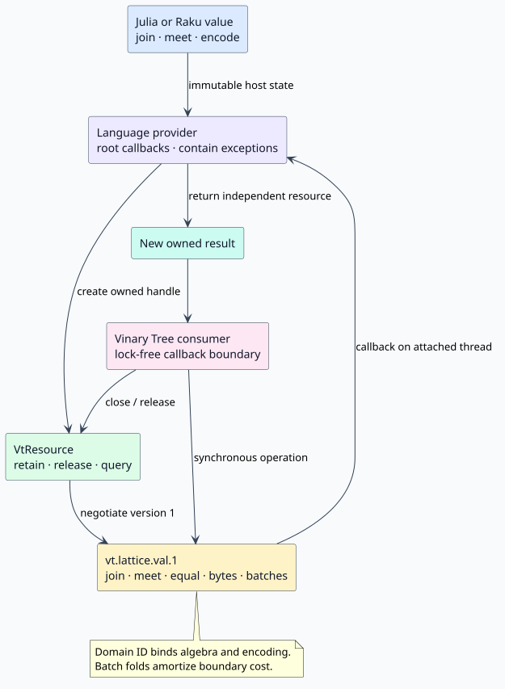

# Foreign-language lattice values

This guide explains how Julia and Raku programs define lattice values that can
flow through Vinary Tree libraries. The native Rust crate remains the
dependency-free owner of the static `Lattice` trait. Foreign packages use the
separate, versioned `vt.lattice.val.1` capability from
[`vinary-tree-interop`](https://github.com/vinary-tree/vinary-tree-interop).

## Vocabulary and laws

A **lattice** is a partially ordered set in which every pair has a least upper
bound, called **join** and written $`\sqcup`$, and a greatest lower bound,
called **meet** and written $`\sqcap`$. A provider must implement operations
that satisfy associativity, commutativity, idempotence, and absorption. For
example, join associativity is:

```math
(a \sqcup b) \sqcup c = a \sqcup (b \sqcup c).
```

The package law checkers exhaustively test a finite witness set. Passing a
finite suite is evidence, not a proof over an infinite domain; the provider
author remains responsible for the declared laws.

## Architecture



The two-word `VtResource` owns a reference to an immutable host value. Querying
it for `vt.lattice.val.1` returns the operation table. Every successful join or
meet returns a new owned resource; closing an input never invalidates an
independent result.

The 16-byte **domain identifier** names the value representation and algebraic
meaning together. Two values with different domains must not be combined. A
canonical stable encoding lets independently implemented providers interoperate
when the receiving provider also supplies a decoder.

## Fold semantics and batching

For receiver $`x`$ and operands $`y_1, \ldots, y_n`$, `join_many` computes the
associative left fold:

```math
\operatorname{join\_many}(x,[y_1,\ldots,y_n])
= (((x \sqcup y_1) \sqcup y_2) \cdots \sqcup y_n).
```

The empty fold returns an independent retain of $`x`$. `meet_many` is the dual
operation. Native batching crosses the foreign-function boundary once and is
the preferred path for a page of values.

```text
algorithm JOIN-MANY(receiver, operands)
    result ← receiver
    for operand in operands do
        result ← JOIN(result, operand)
    return a newly owned result
```

This pseudocode specifies the observable ordering. Associativity permits an
implementation to regroup a lawful fold, but it must not reorder values when a
provider is being diagnosed for a law violation.

## Ownership, failures, and threads

- Treat every provider and operation result as an owned resource. Close it
  deterministically; finalizers are only a fallback.
- Provider exceptions are caught before they cross a C frame. The caller sees
  a typed interop error and can retrieve the provider diagnostic.
- Julia and Raku providers advertise `THREAD_BOUND`; callbacks must execute on
  a thread owned by and attached to the corresponding runtime.
- `PARALLEL_REENTRANT` means callbacks may overlap on valid runtime threads. It
  does not waive thread attachment.
- Native consumers must not call a provider while holding an internal lock.

## Language guides

- [Julia](julia.md) — multiple dispatch, collection behavior, provider
  construction, ownership, type stability, and Documenter API reference.
- [Raku](raku.md) — roles, `Iterable`, NativeCall provider construction,
  deterministic disposal, and zef's native build hook.
- [Performance and benchmarking](performance.md) — cost model, repeated-sample
  methodology, diagnostic evidence, and batch guidance.
- [Capability matrix](completeness-matrix.tsv) — generated-gate input showing
  the implemented public cells and their evidence.

## Security limits

Stable encoders and decoders process untrusted provider data. They must bound
allocation, reject malformed lengths and domain mismatches, and avoid invoking
arbitrary deserialization formats. Batch sizes should normally stay at or
below the interop recommendation of 256 values so one hostile call cannot pin
an unbounded host-language working set.
