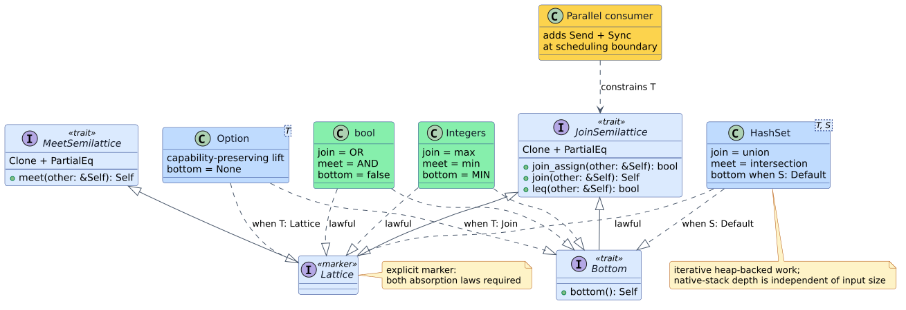

# Architecture

## 1. Scope and boundary

`llattice` is the dependency-free algebra leaf for the vinary-tree crate
family. It owns four traits, lawful standard-library implementations, an
executable law harness, and their formal refinement. It does not own parser
state, graph scheduling, morphism evidence, optimization plans, or thread-pool
policy.

This boundary gives every consumer one coherent meaning for join while keeping
high-level orchestration out of low-level domain values.



## 2. Trait topology

`JoinSemilattice` is the primary optimization capability:

```rust
pub trait JoinSemilattice: Clone + PartialEq {
    fn join_assign(&mut self, other: &Self) -> bool;
    fn join(&self, other: &Self) -> Self;
    fn leq(&self, other: &Self) -> bool;
}
```

The default `join` clones once and delegates to `join_assign`. Implementations
override it when they can choose a better allocation strategy. The default
`leq` uses the defining bridge:

```math
a \preceq b \quad\Longleftrightarrow\quad a \vee b = b
```

`MeetSemilattice` contains `meet`. `Lattice` is an explicit marker requiring
both semilattices, and `Bottom` extends join with a context-free least value.

The marker has no blanket implementation. Suppose both join and meet were
Boolean OR. Each operation is independently idempotent, commutative, and
associative, but
$`\text{false} \wedge (\text{false} \vee \text{true}) = \text{true}`$,
so absorption fails. An explicit `impl Lattice` documents that the author has
checked the cross-operation laws.

## 3. Capability bounds

`Clone` supports the owned default `join`; `PartialEq` defines structural change
and the order bridge. `Send` and `Sync` are intentionally absent. They describe
where a runtime may move or share a value, not whether $`\vee`$ is
idempotent.

Consumers add concurrency at the actual boundary:

```rust
fn parallel_fixpoint<T>(initial: T)
where
    T: llattice::JoinSemilattice + Send + Sync + 'static,
{
    # let _ = initial;
    // scheduler-specific implementation
}
```

This admits single-threaded `Rc`-backed domains without weakening a parallel
engine's requirements.

## 4. Compile-time traits and run-time providers

The family's crates share a second seam beyond this trait: the versioned
**`vinary-tree-interop` resource ABI**. The native `Lattice` trait remains a
compile-time Rust abstraction resolved by monomorphization; `llattice` still
has no runtime dependency and exports no C symbols. Foreign runtimes instead
exchange an immutable `VtResource` that negotiates the distinct
`vt.lattice.val.1` capability. That capability carries owned values and the
operations `join`, `meet`, equality, stable encoding, diagnostics, and bounded
batch folds.

This split preserves both important properties:

- Native Rust keeps a zero-cost, statically dispatched trait and the leaf crate
  remains dependency-free.
- Julia, Raku, and future supported runtimes can implement lattice values
  without pretending a garbage-collected object satisfies Rust's `Clone +
  PartialEq` algebra contract or a consumer's separate `Send + Sync`
  scheduling contract.
- ABI ownership, callback containment, thread declarations, and batching live
  in `vinary-tree-interop`, where all family resources share one protocol.
- The Julia and Raku packages in this repository provide the ergonomic host
  types and adapters. They depend on their language's `vinary-tree-interop`
  package; the Rust crate does not.

The boundary is therefore between *a mathematical interface* and *one portable
runtime representation of values implementing that interface*, not between
llattice and interoperability. [ADR-0004](adr/0004-host-lattice-provider.md)
records the decision, and the [binding architecture](../bindings/README.md)
defines its ownership and concurrency contracts.

## 5. Implementation layout

```text
src/lib.rs       public traits, prelude, and crate contract
src/impls.rs     optimized lawful built-ins
src/laws.rs      reusable executable law/refinement harness
tests/           property, countermodel, hasher, and stack-bound tests
proofs/coq/      unbounded mathematical obligations
benches/         pre-registered hot-path measurements
```

Integer and Boolean operations are inline constant-time specializations.
`Option<T>` preserves capabilities structurally: it implements join when `T`
does, meet when `T` does, and the lattice marker only when `T` is a lattice.
`HashSet<T, S>` is generic over cloneable build hashers; `Bottom` additionally
requires `S: Default` because an empty set must be constructible without
context.

The default `std` feature enables the `HashSet` implementations. With
`default-features = false`, the crate is `no_std` and retains the traits,
scalar implementations, `Option` lift, and executable law harness. Feature
selection changes only which concrete standard-library instances are
available; it does not change any law or method contract.

## 6. Stack-safe execution model

Every input-sized built-in operation is iterative. Set join and meet traverse
iterators backed by heap-resident hash tables. No operation recursively follows
input nesting on the native call stack.

The formal refinement models collection work as a state
$`(P, a)`$, where $`P`$ is the pending list and $`a`$ is the accumulator. One
transition consumes exactly one pending element:

```text
STEP(state):
    if state.pending is empty:
        return HALT
    current ← remove_first(state.pending)
    state.accumulator ← combine(state.accumulator, current)
    return state
```

The Rocq theorem `explicit_worklist_progress` proves that every nonterminal
transition strictly decreases $`|P|`$. The Rust test then runs large set
operations on a 64 KiB thread stack, connecting the abstract machine to the
iterative implementation shape.

Pushdown automata belong one layer above this crate when parsing or tree
matching actually requires a stack alphabet. Introducing a PDA for flat set
algebra would add state and branches without expressing additional semantics.

## 7. Optimization-campaign integration

The division of responsibility is:

```text
llattice      lawful ordered domains and monotone accumulation
libmorphism   typed domain transformations and verification evidence
libvgraph     stack-safe graph kernels and dependency topology
lling-llang   optimization plans, legality, provenance, and execution
PraTTaIL      future GrammarCore front-end and specialized parser automata
Replete       future equality-saturation search after its standalone gate
```

A value compatible with the core optimization pipeline should expose the
smallest lawful capability it has, provide exact structural equality, implement
an allocation-conscious `join_assign`, and add `Send + Sync` only when it enters
parallel scheduling. Full `Lattice` is useful for bidirectional constraint
reasoning; join-only domains remain first-class.

## 8. Migration from 0.1

Version 0.1 placed `join` and `meet` directly on `Lattice`. Version 0.2 requires
the operation traits in method-call scope:

```rust
use llattice::{JoinSemilattice, MeetSemilattice};
```

or:

```rust
use llattice::prelude::*;
```

Implementors split their old implementation, add the exact `join_assign`
contract, and write `impl Lattice for T {}` only after checking absorption.
Raw float and raw sequence implementations must migrate to validated or
canonicalized domain wrappers.

## 9. Related design records

- The coherence argument: [the orphan rule](02-orphan-rule.md).
- The per-implementation contract: [semantics](03-semantics.md).
- The decisions: [ADR-0001](adr/0001-extract-llattice-leaf-crate.md),
  [ADR-0002](adr/0002-semiring-bridge-lives-in-lling-llang.md),
  [ADR-0003](adr/0003-layered-lawful-traits.md), and
  [ADR-0004](adr/0004-host-lattice-provider.md).
