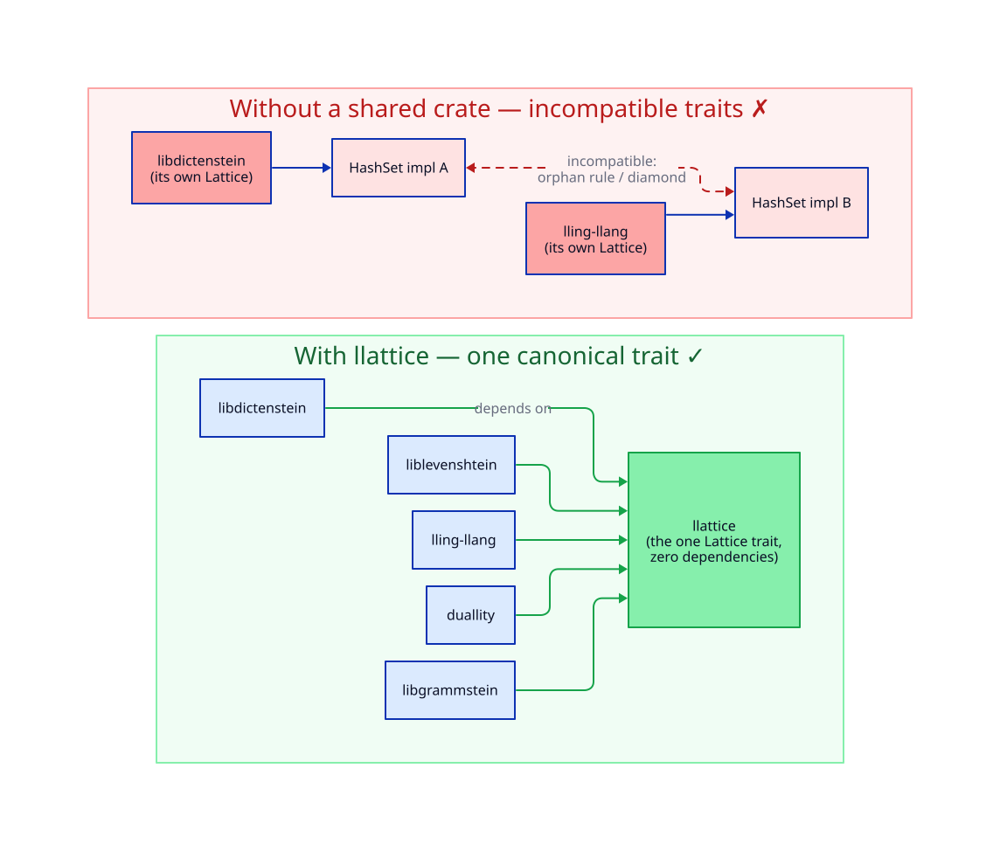

# The Orphan Rule — why `Lattice` is a shared crate

> **Audience.** Rust developers who want the *full* coherence argument behind extracting `Lattice` into its own
> crate. This is the crate's reason to exist, so it gets its own document.

The one-sentence version: *if every family member declared its own `Lattice` trait, those traits would be
mutually incompatible, and any crate depending on two members would be unable to reconcile them.* This document
unpacks that into the precise Rust rules and shows the failure and the fix side by side.

---

## 1. Coherence and the orphan rule

Rust guarantees **trait coherence**: for any (trait, type) pair there is **at most one** implementation in the
entire program. To keep that guarantee decidable across independently-compiled crates, the compiler enforces
the **orphan rule**:

> You may write `impl Trait for Type` only if **your crate defines `Trait`**, or **your crate defines `Type`**
> (more precisely, a local type appears in an uncovered position).

So `impl Lattice for HashSet<T>` is legal **only** in the crate that defines `Lattice` (because `HashSet` is
foreign, from `std`). No downstream crate may add that impl — it is an *orphan* there.

This is not red tape; it is what prevents two libraries from each defining `impl Display for SomeType` with
different behaviour and the linker silently picking one.

---

## 2. The failure: duplicated traits and the diamond

Suppose there were **no** `llattice`, and instead `libdictenstein` and `lling-llang` each defined their own
`Lattice`:

```rust
// libdictenstein (hypothetical, BAD)
pub trait Lattice { fn join(&self, other: &Self) -> Self; /* … */ }
impl<T: Eq + Hash + Clone> Lattice for HashSet<T> { /* union / intersection */ }

// lling-llang (hypothetical, BAD)
pub trait Lattice { fn join(&self, other: &Self) -> Self; /* … */ }
impl<T: Eq + Hash + Clone> Lattice for HashSet<T> { /* union / intersection */ }
```

Both impls are individually legal (each crate defines *its own* `Lattice`). But they are **different traits**
that merely share a name. Now a crate `duallity` depends on both:



The consequences:

- A `HashSet<T>` value produced through `libdictenstein::Lattice` **cannot** be passed where
  `lling-llang::Lattice` is expected — they are unrelated types-of-trait. The two `join`s do not unify.
- `duallity` cannot write a function generic over "a lattice" that accepts values from both — it would have to
  pick one trait, stranding the other.
- The classic **diamond**: two paths to "the lattice of `HashSet`" that do not meet at a single definition. No
  amount of `impl` writing fixes it, because the orphan rule *forbids* `duallity` from adding a reconciling impl
  for the foreign `HashSet`.

This is exactly the situation `libdictenstein` was sliding toward before the extraction.

---

## 3. The fix: one trait in a leaf everyone shares

Define `Lattice` **once**, in a leaf crate, and have every family member depend on it:

```rust
// llattice (the fix) — the ONLY definition of Lattice and the ONLY HashSet impl
pub trait Lattice: Clone + Send + Sync {
    fn join(&self, other: &Self) -> Self;
    fn meet(&self, other: &Self) -> Self;
}
impl<T: Clone + Eq + Hash + Send + Sync> Lattice for HashSet<T> { /* the one true impl */ }
```

Now there is a single `Lattice` trait and a single `HashSet` impl in the whole program. Every family member
refers to *the same* trait, so:

- a `HashSet<T>` lattice flows freely between `libdictenstein`, `lling-llang`, `duallity`, … ;
- a function `fn merge<L: Lattice>(a: &L, b: &L) -> L { a.join(b) }` written anywhere accepts values from
  everywhere;
- coherence is satisfied by construction — there is nothing to reconcile because there was only ever one impl.

The orphan rule even *helps* now: because `llattice` owns `Lattice`, it is the one crate allowed to write the
`std`-type blanket impls, and because the family member crates own *their* types, each may add `impl Lattice
for ItsOwnType` locally. The rule routes every impl to a unique, legal home.

---

## 4. The corollary for the semiring bridge

The same logic dictates where the semiring↔lattice bridge lives. `lling-llang` defines `IdempotentSemiring`,
so **it** — and only it — may write `impl<S: IdempotentSemiring> Lattice for S` (it owns the `IdempotentSemiring`
trait, satisfying the orphan rule). `llattice` *could not* write that impl even if it wanted to, because it
does not define `IdempotentSemiring`. So the architecture is not just convenient but *forced*: the bridge
belongs in `lling-llang`. See [theory/04 §4](../theory/04-semiring-bridge.md#4-why-the-bridge-lives-in-lling-llang-not-here)
and [ADR-0002](adr/0002-semiring-bridge-lives-in-lling-llang.md).

---

## 5. Summary

- Rust's **coherence** guarantee + the **orphan rule** mean a foreign-type impl has exactly one legal home.
- Duplicating the `Lattice` trait per crate produces **incompatible** traits and an unresolvable **diamond**.
- Extracting `Lattice` into a **zero-dependency leaf** gives the family one trait, one impl set, one meaning of
  `join`/`meet` — and routes every future impl to a unique legal location.

→ **[ADR-0001 — extract llattice as a leaf crate](adr/0001-extract-llattice-leaf-crate.md)** records this
decision; **[03 — semantics](03-semantics.md)** documents what each impl does.
