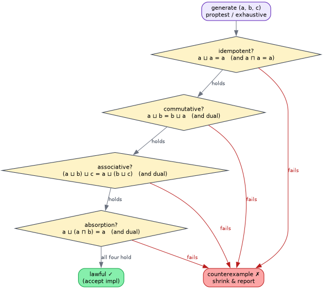

# Testing and verification

## 1. Evidence layers

No single test style establishes the whole contract. The project uses four
complementary layers:



1. Rocq proves abstract laws for arbitrary values under explicit hypotheses.
2. The public `laws` module executes the same obligations over Rust values.
3. Property/exhaustive tests cover built-in implementations and countermodels.
4. Resource and performance tests validate stack, allocation, and throughput
   properties not implied by algebra alone.

The invariant registry names the corresponding theorem, test, and gate for each
obligation.

## 2. Public harness

```rust
use llattice::laws;

laws::check_lattice(&1_i64, &4, &2).unwrap();
laws::check_bottom(&4_i64).unwrap();
```

`check_join_semilattice` checks join idempotency, commutativity, associativity,
`join_assign` value and change refinement, order bridge, and partial-order
axioms. `check_meet_semilattice` checks the dual three laws. `check_lattice`
adds absorption; `check_bottom` adds identity and leastness.

The deterministic `LawViolation` identifies the first failed obligation. This
is useful in downstream property generators and minimizes duplicated law code.

## 3. Generator strategy

Generate values of the actual public carrier. Do not filter an unlawful raw
carrier and then claim the raw type implements the law. A no-`NaN` float
wrapper's generator should call its validating constructor; a canonical set
sequence should generate through its normalization constructor.

For built-ins:

- exhaust both Boolean values;
- use broad signed and unsigned integer generators;
- generate `Option<T>` recursively from a lawful inner generator;
- generate hash sets with duplicates in the source stream so construction and
  equality receive realistic coverage;
- include empty, subset, disjoint, equal-size overlap, and asymmetric-size set
  cases.

## 4. Countermodel tests

Positive examples alone can hide an over-broad trait design. Two negative
fixtures are retained:

- a join implementation with a correct stored value but incorrect change flag;
- Boolean OR used as both join and meet, which passes both independent
  semilattice checks but fails absorption.

The formal suite separately retains raw `NaN` and left-biased sequence
counterexamples. These tests ensure future refactors do not reintroduce blanket
or conditional claims.

## 5. Stack-safety test

The set test spawns a thread with a 64 KiB native stack and processes 150,000
distinct elements. It exercises `join_assign`, `meet`, and `leq`. Passing does
not mathematically prove every downstream implementation stack-safe; it confirms
the built-in source shape does not hide input-depth recursion.

The Rocq explicit-worklist theorem supplies the unbounded transition argument.
Source review connects Rust loops to that machine.

## 6. Commands and resource discipline

Formal verification establishes its own mandatory `systemd-run` scope:

```bash
./proofs/verify.sh
```

Rust validation should likewise run with one Cargo job, an explicit RSS limit,
no swap, bounded tasks, and repository-local temporary/build paths. Capture
output under `target/verification/`, inspect it, then remove generated evidence
when the campaign task closes.

```bash
cargo fmt --all -- --check
cargo test --all-targets
cargo clippy --all-targets -- -D warnings
cargo doc --no-deps
```

Documentation is additionally checked with `vinary-doc-lint`, and diagrams are
rendered from their source before visual inspection.

## 7. Proof limitations

Property testing samples a carrier; it cannot prove universal laws. Rocq proves
the mathematical model; it cannot by itself prove which machine instructions
Rust emits. Stack-depth tests cover concrete builds; they cannot substitute for
source-level recursion audits. The traceability ladder is intentionally
multi-modal because these limitations are different.

QuickCheck's property-testing method is described by Claessen and Hughes,
[https://doi.org/10.1145/351240.351266](https://doi.org/10.1145/351240.351266).
