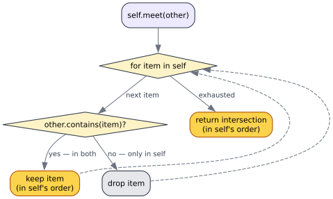

# Performance

> **Goal.** State the time and space complexity of every `join`/`meet`, present the non-trivial algorithms
> (`Vec`) in literate form, and give a clear rule for choosing between `Vec` and `HashSet`. Symbols: $`n = \lvert \texttt{self} \rvert`$,
> $`m = \lvert \texttt{other} \rvert`$.

---

## 1. Complexity at a glance

| Impl | `join` time | `meet` time | Extra space | Notes |
|------|-------------|-------------|-------------|-------|
| `uN`/`iN`/`f32`/`f64`/`bool` | $`\Theta(1)`$ | $`\Theta(1)`$ | $`\Theta(1)`$ | a single `max`/`min`/branch; `#[inline]` |
| `Option<T>` | $`\Theta(1)`$ + one `T` op | $`\Theta(1)`$ + one `T` op | one `T` clone | recurses into `T` only in the `Some/Some` case |
| `HashSet<T>` | $`\Theta(n + m)`$ expected | $`\Theta(\min(n, m))`$ expected | new set | hash ops are expected-$`O(1)`$; see §4 |
| `Vec<T>` | $`O((n+m)\cdot n)`$ = **$`O(n^2)`$** | $`O(n \cdot m)`$ | new vec | linear `contains` inside a loop — quadratic; see §2–3 |

The numeric and `bool` impls are constant-time and allocation-free. `Option` adds at most one wrapped-type
operation and one clone. The two container impls allocate a fresh result (the trait returns owned `Self`); their
*time* is where they differ sharply — and that difference is the whole `Vec`-vs-`HashSet` decision.

---

## 2. The `Vec` algorithms, in literate form

The `Vec` impl is the only non-obvious algorithm in the crate. Presented as literate code chunks
(Knuth-style — prose first, code second), matching `src/lib.rs`.

### `Vec::join` — order-preserving deduplicating union

We keep the left operand verbatim (preserving its order — the *left-biased* choice of
[theory/03 §7](../theory/03-lawfulness-and-proofs.md)), then append each right-operand element that is *not
already present*. "Already present" is a linear scan of the growing result, which is what makes the whole
operation quadratic.

```rust,ignore
fn join(&self, other: &Self) -> Self {
    let mut result = self.clone();          // ── keep self's elements and order verbatim  (Θ(n))
    for item in other {                     // ── for each right-operand element            (m iterations)
        if !result.contains(item) {         // ──── linear membership scan of `result`      (O(n+k) each)
            result.push(item.clone());      // ──── append only genuinely-new elements
        }
    }
    result
}
```


The `result.contains(item)` scan runs in time linear in the current length, inside an $`m`$-iteration loop, giving
$`O((n+m)\cdot n)`$ — quadratic in the input size.

### `Vec::meet` — left-biased intersection

We keep each left-operand element that *also* appears in the right operand, in the left's order. Symmetrically,
`other.contains` is the linear scan.

```rust,ignore
fn meet(&self, other: &Self) -> Self {
    self.iter()                              // ── walk self in order                       (n iterations)
        .filter(|item| other.contains(item)) // ──── keep those present in other            (O(m) each)
        .cloned()
        .collect()
}
```



This is $`\Theta(n \cdot m)`$.

---

## 3. Why `Vec` is quadratic — and when that is fine

The quadratic cost is intrinsic to using an *unindexed sequence* as a set: membership has no shortcut. It is
acceptable when:

- the vectors are **small** (a handful of elements — the constant factors beat hashing), or
- **insertion order is itself part of the value** and must be preserved, which a `HashSet` cannot do.

It is *not* acceptable for large or adversarially-sized inputs — see the algorithmic-complexity attack in
[engineering/03 §3](03-security.md).

---

## 4. `HashSet` cost and the choice rule

`HashSet::join` (union) is expected $`\Theta(n + m)`$ and `meet` (intersection) iterates the smaller set, expected
$`\Theta(\min(n, m))`$ — assuming a well-behaved hasher (each lookup expected $`O(1)`$). The cost is the hashing constant
and the loss of ordering.

> **Rule of thumb.**
> - Want **set semantics** (membership, union, intersection) on more than a few elements? Use **`HashSet`** — it
>   is a genuine lattice on values *and* near-linear.
> - Need to **preserve insertion order** and the collections are **small**? Use **`Vec`**, accepting $`O(n^2)`$ and
>   the left-biased, up-to-content laws.
> - Want both order *and* scale? Neither built-in fits — build a custom `Lattice` over an order-preserving
>   indexed structure (e.g. an index-map) following [guides/02](../guides/02-implementing-lattice.md).

---

## 5. Allocation behaviour and preallocation

Every container `join`/`meet` returns a fresh owned collection — there is no in-place merge in the trait
(`&self`, `&other` ⟶ owned `Self`). Consequences and guidance:

- `Vec::join` starts from `self.clone()` then `push`es; its result has between $`n`$ and $`n + m`$ elements. If you
  merge in a hot loop and know the bound, prefer a custom routine that `Vec::with_capacity(n + m)` up front to
  avoid reallocation churn — preallocation is a best practice here, not a premature optimisation.
- `HashSet::join`/`meet` `collect()` into a new set; for repeated folds, fold into one accumulator
  (`acc = acc.join(&next)`) rather than building a balanced tree of temporaries, to keep peak memory at one
  result-sized set.
- The scalar impls ($`\Theta(1)`$, allocation-free) impose no such concerns.

---

## 6. Benchmarking

The crate ships no benchmarks (its scalar ops are trivially $`\Theta(1)`$), but if you build a custom `Lattice` whose
`join` is non-trivial, benchmark it with `criterion` (statistically sound per-function timings) and confirm the
asymptotics on growing inputs before optimising. Profile real folds rather than guessing — the dominant cost is
almost always the container `contains`/hashing, not the lattice logic.

→ Continue to **[03 — Security](03-security.md)**, which turns the `Vec` quadratic cost and the `f64` `NaN`
defect into a concrete threat model.
