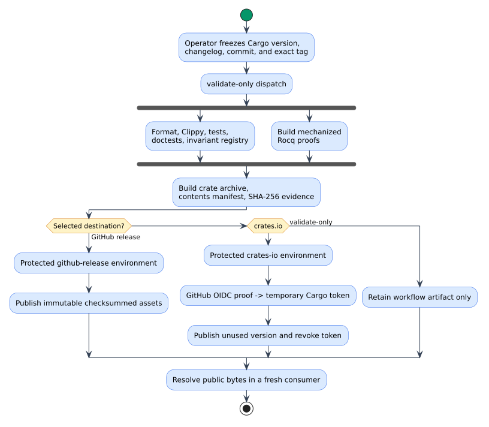

# Releasing `llattice`

This runbook is the operator contract for turning an immutable `llattice`
source tag into a checksummed GitHub release and a crates.io version. A release
is complete only after a fresh consumer resolves and exercises the public
archive; a green source build alone is insufficient.

## Security and identity model

OpenID Connect (OIDC) is a short-lived identity protocol. GitHub signs a claim
identifying the repository, workflow, and protected environment; crates.io
exchanges that claim for a temporary Cargo token and the authentication action
revokes the token when the job ends. No persistent `CARGO_REGISTRY_TOKEN`
belongs in this repository or the Vinary Tree organization.

The release has four independent authorities:

| Authority | Exact source |
|---|---|
| package version | `package.version` in `Cargo.toml` |
| immutable source | annotated tag `vPACKAGE_VERSION` |
| registry publisher | `vinary-tree/llattice`, `release.yml`, environment `crates-io` |
| public evidence | downloaded `.crate`, SHA-256 digest, and fresh-consumer lockfile |

The workflow rejects branches, missing `v` prefixes, mismatched versions, and
corrective tag suffixes. A source defect therefore advances the package
version; the workflow never moves a tag or overwrites a registry version.



## One-time repository and registry setup

Create two GitHub environments in `vinary-tree/llattice`:

- `crates-io`, restricted to tags matching `v*` and protected by the release
  reviewer;
- `github-release`, with the same tag and reviewer restrictions.

After the first manual publication, open the authenticated settings page for
`llattice` on crates.io and configure this exact GitHub Actions trusted
publisher:

| Field | Value |
|---|---|
| Repository | `vinary-tree/llattice` |
| Workflow filename | `release.yml` |
| Environment | `crates-io` |

The workflow filename is only the basename, not
`.github/workflows/release.yml`. All values are case-sensitive. Keep “Require
trusted publishing for all new versions” disabled until one unused version has
successfully passed the OIDC lane; then enable it and revoke the superseded
long-lived crates.io token.

Trusted publishing cannot bootstrap a crate that has never been published.
`llattice 0.1.0` is already public, so no bootstrap token is required here.
Version 0.2 is the first layered API; the workflow's registry preflight rejects
every version already present in the registry.

## Prepare and prove a candidate

1. Choose an unused semantic version and update `Cargo.toml`, `Cargo.lock`, and
   `CHANGELOG.md` together.
2. Run the complete local gate. Wrap Cargo, proof, package, and documentation
   commands in a user `systemd-run --scope` with explicit RSS, no-swap, CPU,
   task, and one-job limits; keep `TMPDIR`, targets, and logs under repository
   `target/`.

   ```bash
   cargo fmt --all -- --check
   cargo clippy --locked --all-targets -- -D warnings
   cargo test --locked --all-targets
   cargo test --locked --doc
   python3 scripts/check-lattice-invariants.py
   python3 scripts/check-release-ref.py --self-test
   make -C proofs/coq proof-check
   make -C proofs/coq
   cargo package --locked --allow-dirty
   ```

3. Commit the complete candidate with an enumerated release message. Rerun
   `cargo package --locked` from the now-clean worktree and inspect the archive
   again. Create an annotated `vPACKAGE_VERSION` tag at that exact commit only
   after the clean package succeeds. Obtain explicit approval before pushing
   either ref.
4. Dispatch validation at the tag:

   ```bash
   gh workflow run release.yml \
     --repo vinary-tree/llattice \
     --ref vPACKAGE_VERSION \
     -f registry=validate-only
   ```

5. Download the `llattice-crate` workflow artifact and verify
   `sha256sum --check SHA256SUMS`. Inspect `PACKAGE-CONTENTS.txt`; it must contain
   only source, license, documentation, tests intentionally shipped with the
   crate, and Cargo metadata.

## Publish one destination at a time

After `validate-only` succeeds, publish the immutable GitHub evidence:

```bash
gh workflow run release.yml \
  --repo vinary-tree/llattice \
  --ref vPACKAGE_VERSION \
  -f registry=github-release
```

Approve only the `github-release` environment. The job refuses to replace an
existing GitHub release. After its assets and hashes are independently
verified, publish crates.io:

```bash
gh workflow run release.yml \
  --repo vinary-tree/llattice \
  --ref vPACKAGE_VERSION \
  -f registry=crates-io
```

Approve only the `crates-io` environment. The job checks that the version is
absent, requests its temporary OIDC token, and invokes `cargo publish --locked`
from the exact tag. A retry is permitted only when crates.io proves that the
version was not accepted.

## Public-byte read-back

Registry propagation is asynchronous, so retry reads without rebuilding or
republishing. Once the exact version resolves, prove it outside every family
worktree:

```bash
READBACK_ROOT="$PWD/target/release-readback"
mkdir -p "$READBACK_ROOT"
cd "$READBACK_ROOT"
cargo init --bin --name llattice_readback
cargo add llattice@=PACKAGE_VERSION
cargo check --locked
cargo run --locked
```

Replace the generated program with:

```rust
use llattice::{JoinSemilattice, MeetSemilattice};

fn main() {
    assert_eq!(5_u32.join(&3), 5);
    assert_eq!(5_u32.meet(&3), 3);
    assert_eq!(true.join(&false), true);
    assert_eq!(true.meet(&false), false);
}
```

Record the resolved registry checksum from `Cargo.lock`, the downloaded
GitHub-asset SHA-256, workflow run URLs, and smoke-test result in the release
ledger or changelog entry. Remove the temporary consumer afterward.

## Failure discipline

- Validation failure: repair source, advance the package version, and create a
  new tag after the complete gate passes.
- GitHub release failure before creation: repair only the workflow in a new
  source version; never replace already-public evidence.
- crates.io rejection before acceptance: diagnose and rerun the same immutable
  tag only when the registry confirms the version is absent.
- Accepted but defective public bytes: yank the version, document the reason,
  repair source, and publish a new version. A yank does not delete history.

The protocol follows the crates.io team's
[trusted-publishing announcement](https://blog.rust-lang.org/2025/07/11/crates-io-development-update-2025-07/),
the [accepted RFC](https://github.com/rust-lang/rfcs/blob/master/text/3691-trusted-publishing-cratesio.md),
and the official
[`crates-io-auth-action`](https://github.com/rust-lang/crates-io-auth-action).
