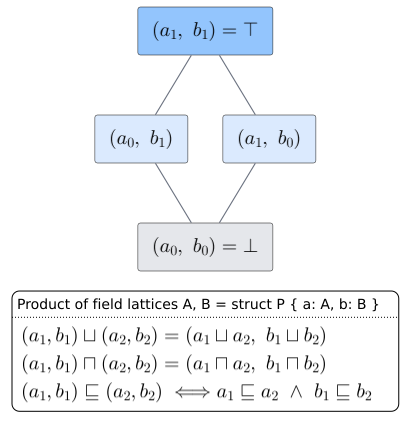

# Implementing `Lattice` for Your Own Type

> **Goal.** Add lawful `join`/`meet` to a type you define. The trait is two methods; the work is choosing what
> "combine upward" and "combine downward" mean and checking the four laws.

---

## 1. The minimal recipe

To implement `Lattice` you must (a) be `Clone + Send + Sync`, and (b) define `join` and `meet`:

```rust
use llattice::Lattice;

/// A monotone version counter that only ever advances.
#[derive(Clone, PartialEq, Debug)]
struct Version(u64);

impl Lattice for Version {
    fn join(&self, other: &Self) -> Self { Version(self.0.max(other.0)) } // newer wins (⊔ = max)
    fn meet(&self, other: &Self) -> Self { Version(self.0.min(other.0)) } // common ancestor (⊓ = min)
}

assert_eq!(Version(7).join(&Version(4)), Version(7));
assert_eq!(Version(7).meet(&Version(4)), Version(4));
```

`Version` is a chain (totally ordered by `0`), so — like the numeric impls — it inherits all four laws for free
(see [theory/03 §2](../theory/03-lawfulness-and-proofs.md)).

---

## 2. The obligations checklist

Before shipping an impl, confirm each item. The first three guarantee CRDT-style convergence; the fourth ties
`join` and `meet` into one consistent order.

- [ ] **`join` is the least upper bound** — `a.join(&b)` is $`\sqsupseteq`$ both `a` and `b`, and is $`\sqsubseteq`$ every common upper
      bound.
- [ ] **`meet` is the greatest lower bound** — the dual.
- [ ] **Idempotency** — `a.join(&a) == a` and `a.meet(&a) == a`.
- [ ] **Commutativity** — `a.join(&b) == b.join(&a)` (and for `meet`).
- [ ] **Associativity** — `(a.join(&b)).join(&c) == a.join(&b.join(&c))` (and for `meet`).
- [ ] **Absorption** — `a.join(&a.meet(&b)) == a` and `a.meet(&a.join(&b)) == a`.
- [ ] **Under which equality?** — decide whether the laws hold under structural `==` or only up to some
      equivalence (as `Vec` holds only up to content-equality). Document it.
- [ ] **`Send + Sync`** — required by the supertrait; automatic for most value types.

Make these executable: [engineering/01 — testing](../engineering/01-testing.md) gives a `proptest` harness that
checks all four laws for any candidate impl.

---

## 3. Composite types: lift, don't re-derive

If your type is built from other lattices, **compose** their `Lattice` impls instead of writing the laws again.

### Product (struct of lattices)

A struct is a lattice componentwise — each field joins/meets independently:

```rust
use llattice::Lattice;

#[derive(Clone, PartialEq, Debug)]
struct Health { hp: u32, shield: u32 }

impl Lattice for Health {
    fn join(&self, o: &Self) -> Self {
        Health { hp: self.hp.join(&o.hp), shield: self.shield.join(&o.shield) }
    }
    fn meet(&self, o: &Self) -> Self {
        Health { hp: self.hp.meet(&o.hp), shield: self.shield.meet(&o.shield) }
    }
}

assert_eq!(
    Health { hp: 10, shield: 2 }.join(&Health { hp: 7, shield: 9 }),
    Health { hp: 10, shield: 9 }, // ⊔ componentwise
);
```

A product of lattices is a lattice, and a product of *distributive* lattices is distributive — so this `Health`
inherits lawfulness from `u32` automatically.

Each field is ordered on its own axis, so the whole struct is ordered by the product of the field orders:



### Optionality: reuse `Option<T>`

To add a "no value yet" bottom, wrap in `Option<T>` rather than hand-rolling a sentinel — `Option`'s impl is the
standard lift and is already lawful ([theory/03 §5](../theory/03-lawfulness-and-proofs.md)):

```rust
use llattice::Lattice;
#[derive(Clone, PartialEq, Debug)]
struct Version(u64);
impl Lattice for Version {
    fn join(&self, o: &Self) -> Self { Version(self.0.max(o.0)) }
    fn meet(&self, o: &Self) -> Self { Version(self.0.min(o.0)) }
}

// Option<Version>: None means "no version observed yet" = ⊥
let seen: Option<Version> = None;
assert_eq!(seen.join(&Some(Version(3))), Some(Version(3))); // first observation fills in
```

---

## 4. Common pitfalls

- **Picking a non-monotone `join`.** If `a.join(&b)` is not actually an upper bound of both, convergence breaks.
  Example bug: `fn join(&self, o) { Version(self.0 + o.0) }` — addition is *not* a least upper bound (it is not
  idempotent: $`a + a \neq a`$). Use `max`.
- **Asymmetric ordering in containers.** If your `join` keeps left-bias like `Vec`, say so: the laws then hold
  only up to your content-equality, not structural `==` ([theory/03 §7](../theory/03-lawfulness-and-proofs.md)).
- **Floating-point fields.** A struct with an `f64` field inherits the `NaN` defect
  ([theory/03 §6](../theory/03-lawfulness-and-proofs.md)); restrict to `NaN`-free values or use an ordered-float
  newtype.
- **Forgetting the dual law.** It is easy to get `join` right and `meet` subtly wrong. Test both, and remember
  absorption couples them.

---

## 5. Next steps

- **See real designs built this way** → [03 — CRDT cookbook](03-crdt-cookbook.md).
- **Prove your impl lawful** → [engineering/01 — testing](../engineering/01-testing.md).
- **Why the trait has no `bottom()`** (and what that means for generic folds) →
  [design/03 §1](../design/03-semantics.md).
