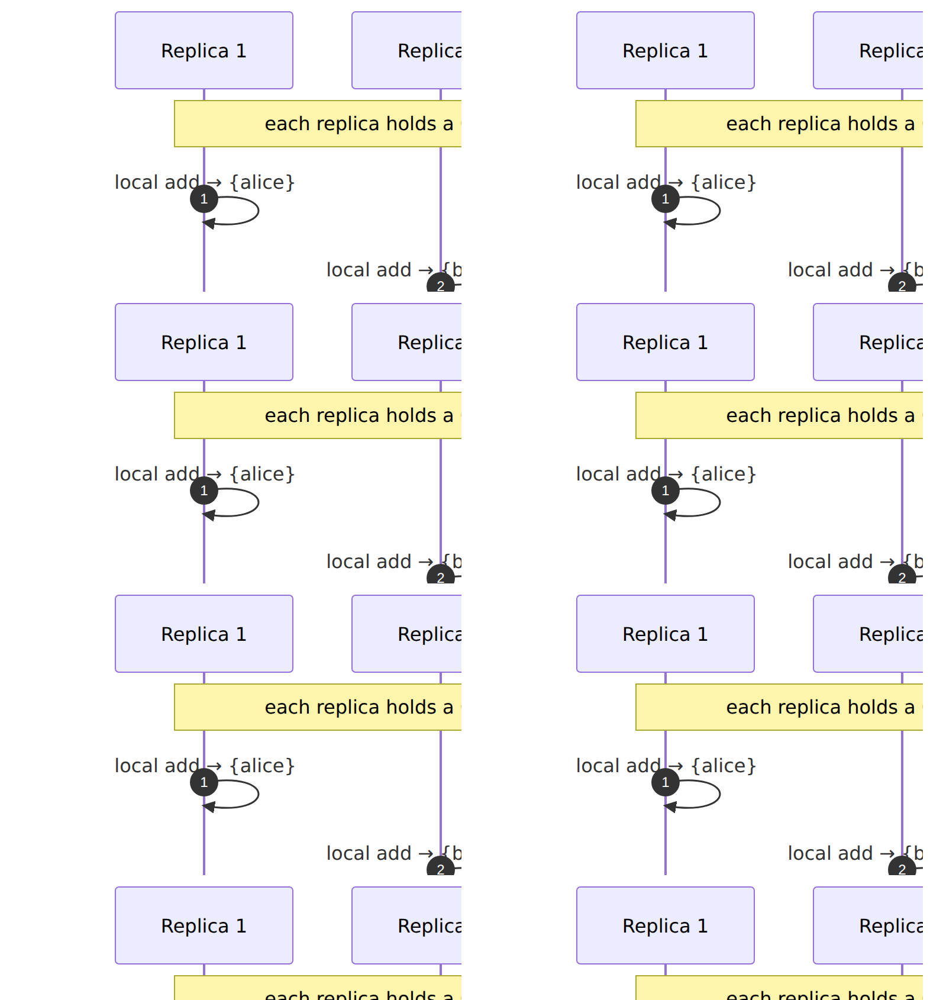

# CRDT Cookbook

> **Goal.** Build **state-based Convergent Replicated Data Types (CvRDTs)** out of `Lattice`. Every recipe is a
> self-contained, compilable `Lattice` instance whose merge is `join`. Because `⊔` is idempotent, commutative,
> and associative ([theory/02 §2](../theory/02-semilattices-lattices.md)), replicas converge with **no
> coordination** — no consensus round-trip, no conflict resolution.

---

## 1. The convergence guarantee

In Shapiro et al.'s formulation, each replica holds a value from a join-semilattice, and merging two replica
states is their `join`. Replicas that have observed the same set of updates converge to the **identical** state,
*regardless of the order, duplication, or batching* of merges:



The grow-only set (**G-Set**) is the simplest CvRDT and needs no custom code — `HashSet`'s built-in lattice *is*
a G-Set:

```rust
use llattice::Lattice;
use std::collections::HashSet;

// Three replicas, each having seen different updates:
let r1: HashSet<&str> = ["alice"].into_iter().collect();
let r2: HashSet<&str> = ["bob", "carol"].into_iter().collect();
let r3: HashSet<&str> = ["alice", "bob"].into_iter().collect();

// Merge in ANY order — the result is always the full set:
let merged = r1.join(&r2).join(&r3);
assert_eq!(merged, ["alice", "bob", "carol"].into_iter().collect());
assert_eq!(merged, r3.join(&r1).join(&r2)); // order-independent (convergence)
```

> **Why no seed?** The empty set `{}` is the lattice bottom for `HashSet`, so it is the natural identity to fold
> from. The trait itself has no generic `bottom()` ([design/03 §1](../design/03-semantics.md)), so you supply
> the concrete `⊥` — here `HashSet::new()` — when folding from nothing.

---

## 2. Grow-only counter (G-Counter)

A counter that only increases. State is one slot per replica; the value is their sum; merge is **element-wise
max** — a product of numeric chains, hence a lawful lattice.

```rust
use llattice::Lattice;

/// Grow-only counter over a fixed set of replicas. Merge = element-wise max.
#[derive(Clone, PartialEq, Debug)]
struct GCounter(Vec<u64>);

impl GCounter {
    fn new(replicas: usize) -> Self { GCounter(vec![0; replicas]) }
    fn incr(&mut self, replica: usize) { self.0[replica] += 1; }
    fn value(&self) -> u64 { self.0.iter().sum() }
}

impl Lattice for GCounter {
    fn join(&self, o: &Self) -> Self {
        GCounter(self.0.iter().zip(&o.0).map(|(a, b)| (*a).max(*b)).collect())
    }
    fn meet(&self, o: &Self) -> Self {
        GCounter(self.0.iter().zip(&o.0).map(|(a, b)| (*a).min(*b)).collect())
    }
}

let mut a = GCounter::new(3);
let mut b = GCounter::new(3);
a.incr(0); a.incr(0); // replica 0 counted twice
b.incr(1);            // replica 1 counted once
let merged = a.join(&b);
assert_eq!(merged.value(), 3);
assert_eq!(merged.join(&a), merged); // re-merging an already-seen state changes nothing (idempotent)
```

---

## 3. Positive-negative counter (PN-Counter)

To allow decrements, keep **two** G-Counters — increments `p` and decrements `n` — and report `sum(p) − sum(n)`.
A product of two lattices is a lattice, so this composes for free:

```rust
use llattice::Lattice;
#[derive(Clone, PartialEq, Debug)]
struct GCounter(Vec<u64>);
impl Lattice for GCounter {
    fn join(&self, o: &Self) -> Self { GCounter(self.0.iter().zip(&o.0).map(|(a, b)| (*a).max(*b)).collect()) }
    fn meet(&self, o: &Self) -> Self { GCounter(self.0.iter().zip(&o.0).map(|(a, b)| (*a).min(*b)).collect()) }
}

/// Positive-negative counter: value = sum(p) − sum(n).
#[derive(Clone, PartialEq, Debug)]
struct PNCounter { p: GCounter, n: GCounter }

impl Lattice for PNCounter {
    fn join(&self, o: &Self) -> Self { PNCounter { p: self.p.join(&o.p), n: self.n.join(&o.n) } }
    fn meet(&self, o: &Self) -> Self { PNCounter { p: self.p.meet(&o.p), n: self.n.meet(&o.n) } }
}
impl PNCounter {
    fn value(&self) -> i64 {
        self.p.0.iter().sum::<u64>() as i64 - self.n.0.iter().sum::<u64>() as i64
    }
}

let a = PNCounter { p: GCounter(vec![2, 0]), n: GCounter(vec![0, 1]) }; // +2 −1 = 1
let b = PNCounter { p: GCounter(vec![0, 3]), n: GCounter(vec![0, 0]) }; // +3    = 3
let m = a.join(&b);                                                     // p=[2,3]=5, n=[0,1]=1
assert_eq!(m.value(), 4);                                              // 5 − 1 = 4
```

---

## 4. Last-writer-wins register (LWW-Register)

A single cell where the write with the greatest timestamp wins. The join is `max` over the timestamp, carrying
its value:

```rust
use llattice::Lattice;

/// LWW register. **Assumes globally unique timestamps**; ties need a deterministic tiebreak
/// (e.g. a replica id appended to `ts`) to stay commutative — see the note below.
#[derive(Clone, PartialEq, Debug)]
struct Lww<T: Clone + PartialEq + Send + Sync> { ts: u64, val: T }

impl<T: Clone + PartialEq + Send + Sync> Lattice for Lww<T> {
    fn join(&self, o: &Self) -> Self { if self.ts >= o.ts { self.clone() } else { o.clone() } }
    fn meet(&self, o: &Self) -> Self { if self.ts <= o.ts { self.clone() } else { o.clone() } }
}

let v1 = Lww { ts: 10, val: "alice" };
let v2 = Lww { ts: 20, val: "bob" };
assert_eq!(v1.join(&v2).val, "bob");   // later write wins
assert_eq!(v2.join(&v1).val, "bob");   // commutative (unique timestamps)
```

> **Tie-breaking is mandatory for correctness.** With *equal* timestamps and different values the impl above is
> not commutative (each side returns itself). A production LWW-Register orders by `(ts, replica_id)` with unique
> replica ids, recovering a total order — and thus all four laws. Encode the tiebreaker into the comparison key.

---

## 5. Version vector

A version vector tracks how many events each replica has observed; the causal merge is **element-wise max** —
identical structure to the G-Counter, and the historical origin of the pattern (Parker et al., 1983):

```rust
use llattice::Lattice;

#[derive(Clone, PartialEq, Debug)]
struct VersionVector(Vec<u64>);

impl Lattice for VersionVector {
    fn join(&self, o: &Self) -> Self { VersionVector(self.0.iter().zip(&o.0).map(|(a, b)| (*a).max(*b)).collect()) }
    fn meet(&self, o: &Self) -> Self { VersionVector(self.0.iter().zip(&o.0).map(|(a, b)| (*a).min(*b)).collect()) }
}

// Replica A: 3 of its own events, 1 seen from B. Replica B: 2 seen from A, 4 of its own.
let a = VersionVector(vec![3, 1]);
let b = VersionVector(vec![2, 4]);
assert_eq!(a.join(&b), VersionVector(vec![3, 4])); // causal join: max per replica
```

This is also the `2^U`-style product that the [isomorphism in theory/02 §4](../theory/02-semilattices-lattices.md)
unifies with `bool` and `HashSet`.

---

## 6. Monotone (Lamport) clock

The smallest CRDT of all: a clock that only advances is `join = max` on a `u64` — already provided by the
numeric impl, no new type needed:

```rust
use llattice::Lattice;

let local: u64 = 7;
let incoming: u64 = 12;
assert_eq!(local.join(&incoming), 12); // clock only moves forward
assert_eq!(local.join(&local), local); // idempotent
```

---

## 7. Set CRDTs that compose the above (LWW-Element-Set, OR-Set)

Richer set CRDTs are **compositions** of the lattices already built, which is the payoff of a shared `Lattice`
vocabulary — you assemble, not re-derive:

- **LWW-Element-Set.** Pair each element with an *add* timestamp and a *remove* timestamp; the state is a map
  `element ↦ (add_lww, remove_lww)`, merged by joining both `Lww` timestamps per element. An element is *present*
  iff its add timestamp strictly exceeds its remove timestamp. This is a map of products of [LWW registers
  (§4)](#4-last-writer-wins-register-lww-register) — lawful because products and maps of lattices are lattices.

- **OR-Set (observed-remove set).** Tag each add with a unique token; removes record the *set of tokens
  observed*. The state is a pair of grow-only sets `(adds, tombstones)` — two [G-Sets (§1)](#1-the-convergence-guarantee)
  — merged element-wise by union. An element is present iff it has an add-token not in the tombstone set. This
  resolves the add/remove concurrency that a plain G-Set cannot.

Both are join-semilattices by construction (products, maps, and unions of join-semilattices are
join-semilattices), so they converge by the same theorem. For the full catalogue and proofs, see Shapiro et
al.'s comprehensive study.

---

## 8. Why this works, in one line

A CvRDT is *exactly* "a value in a join-semilattice, merged by `⊔`". `llattice` gives you the `⊔`; idempotency,
commutativity, and associativity give you eventual consistency without coordination. Verify any custom CRDT's
lawfulness with the [property tests in engineering/01](../engineering/01-testing.md).

→ Next: **[04 — Fixpoints and analysis](04-fixpoints-and-analysis.md)** applies the *order* (not just the merge)
to compute monotone fixed points.

---

## References

1. Shapiro, M., Preguiça, N., Baquero, C., & Zawirski, M. (2011). Conflict-Free Replicated Data Types. In *SSS
   2011*, LNCS 6976, 386–400. Springer. <https://doi.org/10.1007/978-3-642-24550-3_29>.
2. Shapiro, M., Preguiça, N., Baquero, C., & Zawirski, M. (2011). *A comprehensive study of Convergent and
   Commutative Replicated Data Types* (Research Report RR-7506). INRIA. <https://inria.hal.science/inria-00555588>
   — the full CRDT catalogue (G-Counter, PN-Counter, LWW, OR-Set, …).
3. Parker, D. S., et al. (1983). Detection of Mutual Inconsistency in Distributed Systems. *IEEE Transactions on
   Software Engineering*, SE-9(3), 240–247. <https://doi.org/10.1109/TSE.1983.236733> — the origin of version
   vectors.
