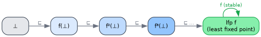

# Fixpoints and Analysis

> **Goal.** Use the *order* of a lattice — not just its merge — to compute **monotone fixed points**: the
> engine behind dataflow analysis, abstract interpretation, and Datalog. Where [the CRDT cookbook](03-crdt-cookbook.md)
> used `⊔` to *combine* states, here we iterate a monotone map *up* the lattice until it stops moving.

---

## 1. Monotone maps and ascending chains

A map `f : L → L` on a lattice is **monotone** if `a ⊑ b ⟹ f(a) ⊑ f(b)` — it never undoes order. Start at `⊥`
and iterate. Because `⊥ ⊑ f(⊥)`, monotonicity propagates the inequality up the whole chain:

```text
⊥ ⊑ f(⊥) ⊑ f²(⊥) ⊑ f³(⊥) ⊑ ⋯
```

On a lattice with no infinite ascending chains (e.g. any finite lattice, or `HashSet` over a finite domain), the
chain **stabilises**: some `fⁿ(⊥) = fⁿ⁺¹(⊥)`. That stable value is a fixed point.



---

## 2. The fixed-point theorems

Two classical results guarantee the fixed point exists and that iteration finds the *least* one.

- **Knaster–Tarski (1955).** Every monotone map on a **complete lattice** has a least fixed point
  `lfp f = ⊓ { x : f(x) ⊑ x }`, and the set of all fixed points is itself a complete lattice. Completeness is
  what guarantees existence — which is why we care that `HashSet` and finite lattices are complete
  ([theory/02 §4](../theory/02-semilattices-lattices.md)).
- **Kleene iteration.** When `f` is additionally **continuous** (preserves suprema of ascending chains), the
  least fixed point is reached by iterating from `⊥`: `lfp f = ⊔ₙ fⁿ(⊥)`. On finite lattices, "iterate until it
  stops changing" computes it exactly.

---

## 3. A worked fixpoint: graph reachability

Reachability is the canonical monotone fixpoint. The reachable set grows monotonically; iterate `join` until
stable. The lattice is `HashSet<u32>` (complete over the finite node set), the bottom is `{}`:

```rust
use llattice::Lattice;
use std::collections::HashSet;

// Directed graph: 0 → 1 → 2, with a self-loop 2 → 2.
const EDGES: [(u32, u32); 3] = [(0, 1), (1, 2), (2, 2)];

/// One monotone step: keep everything reached, add the targets of fired edges, keep the start node 0.
fn step(reached: &HashSet<u32>) -> HashSet<u32> {
    let mut next = reached.clone();
    for &(src, dst) in &EDGES {
        if reached.contains(&src) {
            next = next.join(&[dst].into_iter().collect()); // ⊔ pulls dst into the set
        }
    }
    next.join(&[0].into_iter().collect()) // seed: 0 is always reachable
}

// Kleene iteration from ⊥ = {} to the least fixed point:
let mut x: HashSet<u32> = HashSet::new();
loop {
    let y = step(&x);
    if y == x { break; } // reached the fixed point f(x) = x
    x = y;               // x ⊑ y, climb one rung
}
assert_eq!(x, [0, 1, 2].into_iter().collect());
```

The loop realises exactly the ascending chain `{} ⊑ {0} ⊑ {0,1} ⊑ {0,1,2} = lfp`.

---

## 4. Where this shows up

The same shape powers several analyses; `llattice` supplies the uniform `⊔` (to accumulate facts) and the order
(to detect the fixed point).

- **Dataflow analysis (Kildall, 1973).** Each program point carries a lattice value (live variables, available
  expressions, constant ranges). The transfer functions are monotone; the analysis is the meet-/join-over-all-paths
  fixed point. `join` merges information flowing into a join point.
- **Abstract interpretation (Cousot & Cousot, 1977).** Concrete semantics are over-approximated in a lattice of
  *abstract values* connected to the concrete domain by a Galois connection. Soundness is monotonicity; the
  analysis result is `lfp` of the abstract transfer function. For lattices of *infinite* height, **widening**
  `∇` accelerates (and forces) convergence where plain iteration would not terminate (Cousot & Cousot, 1979).
- **Datalog / logic programming.** A set of monotone rules defines an operator `T_P` on the lattice of
  derivable facts; the program's meaning is `lfp T_P`, computed by naïve/semi-naïve iteration — again "join in
  the newly-derived facts until nothing new appears".

In each case the discipline is the same: model the state as a lattice, make the step monotone, iterate from `⊥`
to the least fixed point.

---

## 5. Practical notes

- **Termination.** Iteration terminates only if the lattice has no infinite ascending chains *along the path the
  step takes*. `HashSet` over a bounded universe is fine; an unbounded `Vec`/`HashSet` that can grow forever is
  not — bound the domain or apply widening.
- **Least vs. greatest.** Iterating up from `⊥` gives the **least** fixed point (the smallest consistent
  solution — e.g. *minimal* reachable set). Dually, iterating down from `⊤` with `meet` gives the greatest fixed
  point (used for safety/coinductive properties). `llattice` gives you both directions via `join`/`meet`.
- **Monotonicity is the proof obligation.** If your step is not monotone, none of the guarantees hold — verify
  it the same way you verify a `Lattice` impl ([engineering/01](../engineering/01-testing.md)).

→ Back to the [guides index](../README.md#guides), or dig into the theory at
[theory/02 — lattices](../theory/02-semilattices-lattices.md).

---

## References

1. Tarski, A. (1955). A lattice-theoretical fixpoint theorem and its applications. *Pacific Journal of
   Mathematics*, 5(2), 285–309. <https://doi.org/10.2140/pjm.1955.5.285>.
2. Cousot, P., & Cousot, R. (1977). Abstract interpretation: a unified lattice model for static analysis of
   programs by construction or approximation of fixpoints. In *POPL '77*, 238–252.
   <https://doi.org/10.1145/512950.512973>.
3. Cousot, P., & Cousot, R. (1979). Systematic design of program analysis frameworks. In *POPL '79*, 269–282.
   <https://doi.org/10.1145/567752.567778> — Galois connections and widening.
4. Kildall, G. A. (1973). A unified approach to global program optimization. In *POPL '73*, 194–206.
   <https://doi.org/10.1145/512927.512945> — dataflow analysis as lattice fixpoint iteration.
