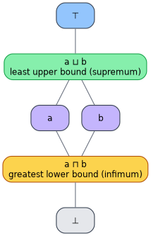
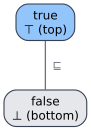
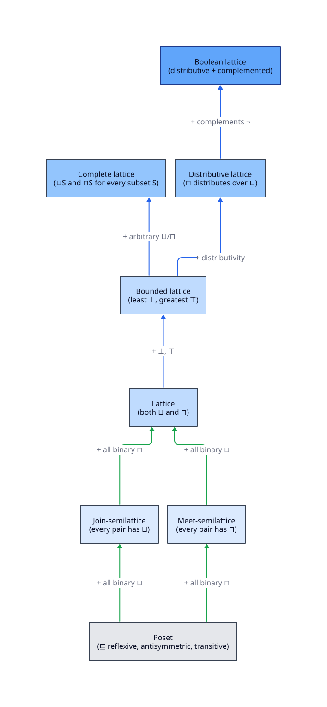
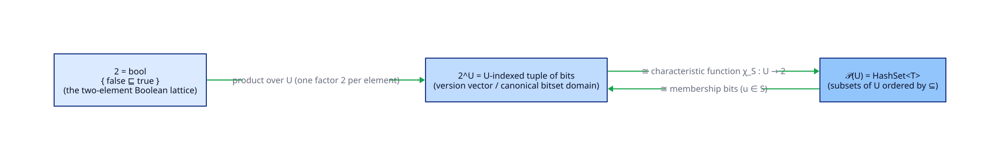
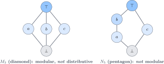

# Semilattices and Lattices — the two operations and their laws

> **Prerequisite:** [01 — Order theory](01-order-theory.md). We freely use poset, $`\sqsubseteq`$, $`\lessdot`$, $`\bot`$, $`\top`$,
> and Hasse diagrams from there. All symbols are in the [glossary](../GLOSSARY.md).

This document promotes a poset to a **lattice** by demanding least upper bounds and greatest lower bounds,
states the four algebraic laws those operations obey, proves the theorem that the order and the operations are
two views of one structure, and then classifies the richer kinds of lattice (bounded, complete, distributive,
Boolean) that the built-in impls realise.

---

## 1. Semilattices and lattices

Let $`(S, \sqsubseteq)`$ be a poset.

- It is a **join-semilattice** if every pair $`\{a, b\}`$ has a least upper bound $`a \sqcup b`$ (the **join**).
- It is a **meet-semilattice** if every pair $`\{a, b\}`$ has a greatest lower bound $`a \sqcap b`$ (the **meet**).
- It is a **lattice** if it is *both*: every pair has a $`\sqcup`$ *and* a $`\sqcap`$.

The `Lattice` trait asks for both methods, so it targets full lattices — but two of its impls (`Vec`, and any
non-NaN-free `f64` usage) only honour the join half cleanly; that nuance is the subject of
[document 03](03-lawfulness-and-proofs.md).

The defining geometry is worth fixing in the mind's eye. For any two elements $`a`$ and $`b`$:



$`a \sqcup b`$ is the *lowest* element still above both $`a`$ and $`b`$; $`a \sqcap b`$ is the *highest* element still below
both. The mnemonic — used in every diagram in this repository — is **green climbs up (join), amber descends
(meet)**.

The smallest non-trivial lattice is `bool`:



Here $`\sqcup = \lor`$ (logical OR), $`\sqcap = \land`$ (logical AND), $`\bot = \text{false}`$, $`\top = \text{true}`$.

---

## 2. The four laws

$`\sqcup`$ and $`\sqcap`$ are not arbitrary binary operations: as least-upper- and greatest-lower-bound operators they
*necessarily* satisfy four laws. For all $`a, b, c`$:

| Law | Join form | Meet form |
|----------------|------------------------------|------------------------------|
| **Idempotency**   | $`a \sqcup a = a`$ | $`a \sqcap a = a`$ |
| **Commutativity** | $`a \sqcup b = b \sqcup a`$ | $`a \sqcap b = b \sqcap a`$ |
| **Associativity** | $`(a \sqcup b) \sqcup c = a \sqcup (b \sqcup c)`$ | $`(a \sqcap b) \sqcap c = a \sqcap (b \sqcap c)`$ |
| **Absorption**    | $`a \sqcup (a \sqcap b) = a`$ | $`a \sqcap (a \sqcup b) = a`$ |

Each row is a dual pair ([01 §4](01-order-theory.md#4-the-duality-principle)), so proving the join form gives
the meet form for free.

> **Why these laws are the point, not decoration.** Idempotency, commutativity, and associativity are exactly
> the conditions under which *folding a multiset in any order, with any grouping, with repeats, yields one
> answer*. That is the convergence guarantee CRDTs rely on (see [guides/03](../guides/03-crdt-cookbook.md)):
>
> - **Idempotency** $`a \sqcup a = a \implies`$ delivering the same update twice is a no-op (at-least-once delivery is safe).
> - **Commutativity** $`a \sqcup b = b \sqcup a \implies`$ the arrival order of two updates does not matter.
> - **Associativity** $`(a \sqcup b) \sqcup c = a \sqcup (b \sqcup c) \implies`$ how a batch is parenthesised does not matter.
>
> A binary operation that is associative, commutative, and idempotent is *equivalent data* to a
> join-semilattice — this is the **fundamental theorem of semilattices**, proved next.

### Lemma (absorption forces compatible domains)

Absorption is what *links* $`\sqcup`$ and $`\sqcap`$. Idempotency, commutativity, and associativity alone describe two
independent semilattices; absorption is the axiom that says they order the same set the same way (so that the
order read off $`\sqcup`$ agrees with the order read off $`\sqcap`$). We use it in §3.

---

## 3. The order/operation bridge

The order $`\sqsubseteq`$ and the operations $`\sqcup`$, $`\sqcap`$ are **two presentations of one structure**. This is the single most
important theorem in lattice theory and the reason `llattice` can offer *either* view.

### Theorem (connecting lemma)

Let $`(S, \sqsubseteq)`$ be a lattice with operations $`\sqcup`$, $`\sqcap`$. Then for all $`a, b \in S`$:

```math
a \sqsubseteq b \iff a \sqcup b = b \iff a \sqcap b = a
```

Conversely, given a set $`S`$ with operations $`\sqcup`$, $`\sqcap`$ satisfying the four laws of §2, defining
$`a \sqsubseteq b :\iff a \sqcup b = b`$ yields a partial order whose least upper bound is $`\sqcup`$ and greatest lower bound is $`\sqcap`$.
The two constructions are mutually inverse.

### Proof

**($`\Rightarrow`$, first equivalence.)** Suppose $`a \sqsubseteq b`$. Then $`b`$ is an upper bound of $`\{a, b\}`$ (since $`a \sqsubseteq b`$ and
$`b \sqsubseteq b`$). Any upper bound $`u`$ of $`\{a, b\}`$ satisfies $`b \sqsubseteq u`$, so $`b`$ is the *least* upper bound, i.e.
$`a \sqcup b = b`$.

**($`\Leftarrow`$, first equivalence.)** Suppose $`a \sqcup b = b`$. Since $`a \sqcup b`$ is an upper bound of $`a`$, we have
$`a \sqsubseteq a \sqcup b = b`$, hence $`a \sqsubseteq b`$.

**(second equivalence.)** Dually, $`a \sqsubseteq b \iff a \sqcap b = a`$: if $`a \sqsubseteq b`$ then $`a`$ is a lower bound of $`\{a, b\}`$ and,
being $`\sqsubseteq`$ every lower bound's target, the *greatest* one, so $`a \sqcap b = a`$; conversely $`a \sqcap b = a`$ gives
$`a = a \sqcap b \sqsubseteq b`$. ∎

**(converse — the laws rebuild the order.)** Define $`a \sqsubseteq b :\iff a \sqcup b = b`$.

- *Reflexive:* $`a \sqcup a = a`$ by idempotency, so $`a \sqsubseteq a`$.
- *Antisymmetric:* if $`a \sqcup b = b`$ and $`b \sqcup a = a`$, then by commutativity $`a = b \sqcup a = a \sqcup b = b`$.
- *Transitive:* if $`a \sqcup b = b`$ and $`b \sqcup c = c`$, then $`a \sqcup c = a \sqcup (b \sqcup c) = (a \sqcup b) \sqcup c = b \sqcup c = c`$
  (associativity, then the hypotheses), so $`a \sqsubseteq c`$.

That $`\sqcup`$ computes the least upper bound of $`\{a, b\}`$ under this $`\sqsubseteq`$, and $`\sqcap`$ the greatest lower bound, follows
from absorption: $`a \sqsubseteq a \sqcup b`$ because $`a \sqcup (a \sqcup b) = (a \sqcup a) \sqcup b = a \sqcup b`$; minimality and the meet side are the
duals, using $`a \sqcup (a \sqcap b) = a`$ to show $`a \sqcap b \sqsubseteq a`$. ∎

> **Consequence for `llattice`.** This is why the docs sometimes speak of $`\sqsubseteq`$ and sometimes of $`\sqcup`$/$`\sqcap`$: they
> are interchangeable. For `u32`, $`a \sqcup b = b`$ *is* $`\max(a,b) = b`$ *is* $`a \leq b`$. For `HashSet`, $`a \sqcup b = b`$ *is*
> $`a \cup b = b`$ *is* $`a \subseteq b`$.

---

## 4. The structure hierarchy

Demanding more of a lattice yields the specialised structures the built-in impls inhabit. Each is the previous
plus one axiom:



- **Bounded lattice** — has a $`\bot`$ and a $`\top`$. (Numeric types: `MIN`/`MAX`. `bool`: `false`/`true`.)
- **Complete lattice** — *every* subset, not just every pair, has a $`\sqcup`$ and $`\sqcap`$. Finite lattices are
  automatically complete; $`\mathcal{P}(U)`$ is complete for any $`U`$. Completeness is what guarantees fixed points exist
  (Tarski; see [guides/04](../guides/04-fixpoints-and-analysis.md)).
- **Distributive lattice** — $`\sqcap`$ distributes over $`\sqcup`$: $`a \sqcap (b \sqcup c) = (a \sqcap b) \sqcup (a \sqcap c)`$. Chains and power
  sets are distributive.
- **Boolean lattice** — bounded, distributive, and **complemented**: every $`a`$ has $`\lnot a`$ with $`a \sqcup \lnot a = \top`$ and
  $`a \sqcap \lnot a = \bot`$. `bool` and $`\mathcal{P}(U)`$ are Boolean.

### Atoms, coatoms, and `2^U`

An **atom** covers $`\bot`$; a **coatom** is covered by $`\top`$. In $`\mathcal{P}(\{1,2,3\})`$ the singletons are the atoms. A finite
Boolean lattice is determined by its atoms: it is isomorphic to the power set of its atom set, equivalently to a
product of copies of $`\mathbf{2}`$:

```math
\mathcal{P}(U) \;\cong\; 2^U \;\cong\; (\text{a } U\text{-indexed tuple of bits})
```

This single isomorphism unifies three of the built-in impls — `bool` is the factor $`\mathbf{2}`$, a version vector is the
product $`2^U`$, and `HashSet` is the power set $`\mathcal{P}(U)`$:



---

## 5. Distributivity and the two forbidden sublattices

Distributivity is *not* automatic — and there is a beautiful structural test for it. **Birkhoff's criterion**:
a lattice is distributive **if and only if** it contains neither the *diamond* $`M_3`$ nor the *pentagon* $`N_5`$ as a
sublattice.



- $`M_3`$ (the diamond) is **modular** but not distributive — it is the lattice of a 2-dimensional vector space's
  subspaces in miniature.
- $`N_5`$ (the pentagon) is not even modular.

Why this matters here: the built-in impls are *all* distributive, and we can now say *why* — the numeric types
are chains (a chain contains neither $`M_3`$ nor $`N_5`$, since both require incomparable elements), and $`\mathcal{P}(U)`$ is a
power set (Boolean $`\implies`$ distributive). No built-in impl embeds $`M_3`$ or $`N_5`$. The `Lattice` trait itself, however,
imposes **no** distributivity, so a *user* impl may be non-distributive; the documentation never assumes
distributivity of arbitrary `Lattice` types.

---

## 6. Where to go next

The laws and structures are in place. The next document confronts the impls with these laws and asks, bluntly,
*which laws does each built-in impl actually satisfy, and under which notion of equality?* — exposing the two
places (`f64` with `NaN`, and `Vec`) where the textbook story needs care.

→ **[03 — Lawfulness and proofs](03-lawfulness-and-proofs.md)**

---

## References

1. Davey, B. A., & Priestley, H. A. (2002). *Introduction to Lattices and Order* (2nd ed.). Cambridge
   University Press. <https://doi.org/10.1017/CBO9780511809088> — §2.4–2.10 (lattices as algebras, the connecting
   lemma); §4.10 (the $`M_3`$–$`N_5`$ theorem).
2. Birkhoff, G. (1967). *Lattice Theory* (3rd ed.). AMS Colloquium Publications, Vol. 25.
   <https://doi.org/10.1090/coll/025> — Chapters I–II.
3. Tarski, A. (1955). A lattice-theoretical fixpoint theorem and its applications. *Pacific Journal of
   Mathematics*, 5(2), 285–309. <https://doi.org/10.2140/pjm.1955.5.285> — completeness $`\implies`$ fixed points.
