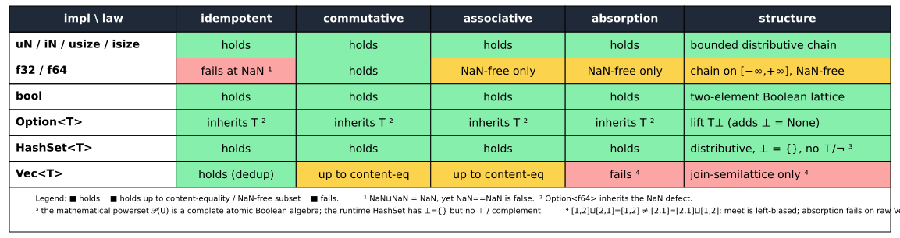
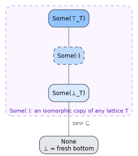
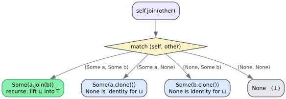
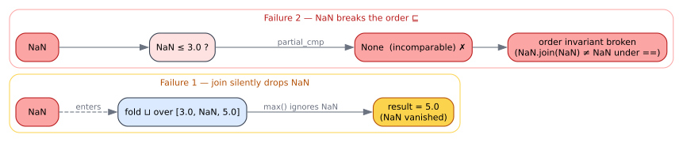
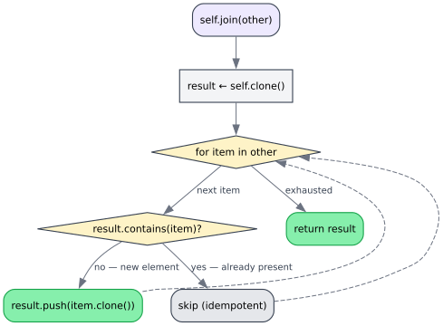

# Lawfulness and Proofs — which laws hold, and under which equality

> **Prerequisite:** [02 — Semilattices and lattices](02-semilattices-lattices.md) for the four laws and the
> connecting theorem. Symbols are in the [glossary](../GLOSSARY.md).

The trait doc-comment once claimed the impls "satisfy the following properties" without qualification. That is
**not true universally**: `f64` breaks idempotency in the presence of `NaN`, and `Vec` is only a
join-semilattice *up to content-equality*. This document states the precise, **scoped** truth — a lawfulness
matrix — and proves it impl by impl. It is the authoritative reference behind the corrected rustdoc.

---

## 1. The lawfulness matrix at a glance



| | idempotent | commutative | associative | absorption | structure |
|---|---|---|---|---|---|
| `uN`/`iN`/`usize`/`isize` | ✅ | ✅ | ✅ | ✅ | bounded distributive **chain** |
| `f32`/`f64` | ⚠️ fails at `NaN` | ✅ | ⚠️ NaN-free | ⚠️ NaN-free | chain on `[−∞,+∞]`, NaN-free only |
| `bool` | ✅ | ✅ | ✅ | ✅ | two-element **Boolean** lattice |
| `Option<T>` | ✅¹ | ✅¹ | ✅¹ | ✅¹ | **lift** `T⊥` (adds `⊥ = None`) |
| `HashSet<T>` | ✅ | ✅ | ✅ | ✅ | distributive, `⊥ = {}`, no `⊤`/`¬` at runtime |
| `Vec<T>` | ✅ (dedup) | ⚠️ up to content-eq | ⚠️ up to content-eq | ❌ fails on raw `Vec` | **join-semilattice** on the content quotient |

Legend: ✅ holds under structural `==`; ⚠️ holds only up to content-equality or on the NaN-free subset;
❌ fails. ¹ `Option<T>` inherits `T`'s status exactly — `Option<f64>` inherits the `NaN` defect.

---

## 2. Numeric types — `join = max`, `meet = min`

For any `Ord` numeric type the impl is `a.join(b) = max(a,b)`, `a.meet(b) = min(a,b)`, and `⊑` is `≤`.

**Claim.** Each numeric type is a bounded distributive lattice that is a *chain* (totally ordered).

**Proof.** `≤` is a total order, so for any `a, b` either `a ≤ b` or `b ≤ a`; in the first case
`max(a,b) = b` and `min(a,b) = a`, in the second the reverse. The four laws follow from elementary properties
of `max`/`min` on a total order:

- *Idempotency:* `max(a,a) = a`, `min(a,a) = a`.
- *Commutativity:* `max`/`min` are symmetric.
- *Associativity:* `max(max(a,b),c) = max(a,b,c) = max(a,max(b,c))`; dually for `min`.
- *Absorption:* `max(a, min(a,b)) = a` since `min(a,b) ≤ a`; `min(a, max(a,b)) = a` since `a ≤ max(a,b)`.

Distributivity holds because every chain is distributive (a chain contains no incomparable pair, hence no `M₃`
or `N₅`; see [02 §5](02-semilattices-lattices.md#5-distributivity-and-the-two-forbidden-sublattices)).
Boundedness is `MIN`/`MAX`. ∎

These impls are the gold standard: every law holds under the machine `==`, with no caveats.

---

## 3. `bool` — the two-element Boolean lattice

`true.join(b) = a || b`, `a.meet(b) = a && b`, `⊥ = false`, `⊤ = true`.

**Claim.** `bool` is the two-element Boolean lattice (the smallest non-degenerate Boolean algebra).

**Proof.** `bool` is the chain `false ≤ true`, so by §2 it is a bounded distributive lattice. It is
**complemented**: `¬false = true`, `¬true = false`, and `a || ¬a = true = ⊤`, `a && ¬a = false = ⊥`. A bounded
distributive complemented lattice is a Boolean algebra. ∎

Every other Boolean impl is built from this one: `𝒫(U) ≅ 2^U` (a product of copies of `bool`), which is the
unifying isomorphism of [02 §4](02-semilattices-lattices.md#atoms-coatoms-and-2u).

---

## 4. `HashSet<T>` — union and intersection

`a.join(b) = a ∪ b`, `a.meet(b) = a ∩ b`, `⊑` is `⊆`, `⊥ = {}`.

**Claim (mathematical).** The power set `𝒫(U)` of any universe `U`, ordered by `⊆`, is a **complete atomic
Boolean algebra**: atoms are singletons, complement is set-complement in `U`, arbitrary unions/intersections
exist.

**Proof.** Union and intersection are idempotent, commutative, and associative; absorption is
`a ∪ (a ∩ b) = a` and `a ∩ (a ∪ b) = a`, both immediate from `a ∩ b ⊆ a ⊆ a ∪ b`. Distributivity of `∩` over
`∪` is the standard set identity. Completeness: `⋃` and `⋂` of any family of subsets are subsets. Complement
`¬S = U ∖ S` satisfies `S ∪ ¬S = U = ⊤`, `S ∩ ¬S = {} = ⊥`. ∎

**Claim (the runtime impl is a *fragment*).** The Rust type `HashSet<T>` models subsets of the *open,
unbounded* universe of all `T` values. It therefore has `⊥ = {}` but **no `⊤`** (no greatest finite set when
`T` is infinite) and **no computable complement** (`U ∖ S` is not finite). So at runtime `HashSet<T>` realises
the **bounded-below distributive lattice** fragment — the join-semilattice with bottom plus a meet — *not* the
full Boolean algebra. The Boolean/complete structure is recovered only once you fix a finite universe `U`.

This distinction is carried into [design/03 — semantics](../design/03-semantics.md), which is careful never to
promise a `HashSet` `⊤`.

---

## 5. `Option<T>` — the lift (bottom adjunction)

```rust
// from src/lib.rs
fn join(&self, other: &Self) -> Self {
    match (self, other) {
        (Some(a), Some(b)) => Some(a.join(b)),
        (Some(a), None)    => Some(a.clone()),
        (None, Some(b))    => Some(b.clone()),
        (None, None)       => None,
    }
}
fn meet(&self, other: &Self) -> Self {
    match (self, other) {
        (Some(a), Some(b)) => Some(a.meet(b)),
        _                  => None,
    }
}
```





**Claim.** `Option<T>` is the **lift** `T⊥`: it adjoins a fresh least element `None` below an order-isomorphic
copy of `T`. If `T` is a lattice then `Option<T>` is a lattice, with `⊥ = None`, induced order
`None ⊑ Some(_)` and `Some(a) ⊑ Some(b) ⟺ a ⊑ b`, and (if `T` has a top) `⊤ = Some(⊤_T)`.

**Proof.** `None` is the identity for `⊔` (`None ⊔ x = x` by the match) and the annihilator for `⊓`
(`None ⊓ x = None`), which is exactly "a new bottom". On `Some(_)` both operations recurse:
`Some(a) ⊔ Some(b) = Some(a ⊔ b)`, `Some(a) ⊓ Some(b) = Some(a ⊓ b)`. Each law lifts by case analysis on the
match; we show absorption, the subtlest:

- `None ⊔ (None ⊓ x) = None ⊔ None = None` ✓ and `Some(a) ⊔ (Some(a) ⊓ None) = Some(a) ⊔ None = Some(a)` ✓.
- `Some(a) ⊔ (Some(a) ⊓ Some(b)) = Some(a) ⊔ Some(a ⊓ b) = Some(a ⊔ (a ⊓ b)) = Some(a)` by `T`'s absorption ✓.

The remaining laws are analogous. ∎

> **Inheritance caveat.** "If `T` is a lattice" is load-bearing: `Option<T>` is lawful *exactly to the extent
> `T` is*. `Option<f64>` inherits the `NaN` defect of §6; `Option<Vec<U>>` inherits the content-equality
> caveat of §7. The lift adds a clean bottom; it cannot repair the wrapped type.

---

## 6. `f32` / `f64` — lawful only on the NaN-free extended reals

`a.join(b) = a.max(b)`, `a.meet(b) = a.min(b)`. Rust's `f64::max`/`f64::min` implement the IEEE-754
`maxNum`/`minNum` operations: **if exactly one argument is `NaN`, the other is returned**; if both are `NaN`,
`NaN` is returned.

**Claim (positive).** On the NaN-free extended reals `[−∞, +∞]`, `f32`/`f64` form a bounded lattice — in fact
a **chain** — with `⊥ = −∞`, `⊤ = +∞`. (Proof: identical to §2; the values are totally ordered.)

**Claim (negative — the defect).** On the full set including `NaN`, the lattice laws fail:

- **Idempotency fails under `==`.** `NaN.join(&NaN)` evaluates to `NaN` (both args `NaN`), but `NaN == NaN` is
  `false`. So `a ⊔ a = a` does **not** hold at `a = NaN` *when equality is structural `==`*. This is the
  decisive failure: a property test `a.join(&a) == a` returns `false` for `NaN`.
- **The order breaks.** `NaN.partial_cmp(&x)` is `None` for every `x` — `NaN` is incomparable. So `(f64, ≤)` is
  only a *partial* order, and the connecting theorem
  ([02 §3](02-semilattices-lattices.md#3-the-orderoperation-bridge)) `a ⊑ b ⟺ a ⊔ b = b` has no content at
  `NaN`.
- **Silent data loss.** Because `max(NaN, x) = x`, a fold of `[3.0, NaN, 5.0]` under `⊔` returns `5.0` — the
  `NaN` simply vanishes rather than poisoning or being rejected.



**Non-issue: signed zero.** `-0.0 == 0.0` is `true` and `max`/`min` treat them as equal, so signed zero breaks
nothing — mentioned only to forestall the question.

**Practical rule.** Use the float impl only on values you have already excluded `NaN` from (validate at the
boundary, or use an ordered-float newtype). [engineering/03 — security](../engineering/03-security.md) treats
`NaN` as a correctness-poisoning input.

---

## 7. `Vec<T>` — a join-semilattice on the content quotient

```rust
// from src/lib.rs
fn join(&self, other: &Self) -> Self {        // concat + dedup, order-preserving, left-biased
    let mut result = self.clone();
    for item in other { if !result.contains(item) { result.push(item.clone()); } }
    result
}
fn meet(&self, other: &Self) -> Self {        // intersection, in self's order (left-biased)
    self.iter().filter(|x| other.contains(x)).cloned().collect()
}
```



The temptation is to call this "the lattice of finite sequences". It is **not** a lattice on `Vec` *values*.
Two things go wrong, and the documentation must state both.

**Defect 1 — commutativity holds only up to content-equality.** Define content-equality `a ≈ b` to mean "same
set of elements". Then:

```text
[1,2].join(&[2,1]) = [1,2]      (2 and 1 already present)
[2,1].join(&[1,2]) = [2,1]
[1,2] ≈ [2,1]   but   [1,2] ≠ [2,1]   as Vec values
```

So `a ⊔ b = b ⊔ a` holds under `≈` but **fails** under structural `Vec::==` — `join` is *left-biased* in the
ordering of its result. Associativity is likewise only an `≈`-identity.

**Defect 2 — absorption is not a `Vec`-value law, and `meet` is not a true glb.** `meet` keeps the *left*
operand's elements in the *left* operand's order, discarding the right operand's ordering entirely. Hence
`x ⊓ y` and `y ⊓ x` can differ as `Vec` values even when their *contents* agree, so `⊓` is commutative only up
to `≈`. Because `⊓`'s result order tracks the left operand while `⊔`'s does too but with the opposite bias, the
absorption identities `a ⊔ (a ⊓ b) = a` and `a ⊓ (a ⊔ b) = a` are **not** identities on raw `Vec` values in
general; they hold only after quotienting by `≈`.

**Correct framing.** Treat a `Vec` as *the set of its elements, with insertion order kept as a canonical
representative*. On the quotient `Vec/≈`:

- `Vec::join` is a genuine **join-semilattice** operation, order-isomorphic to finite-`HashSet` union;
- `Vec::meet` computes set intersection on contents (a derived greatest lower bound on the quotient).

So `(Vec, join, meet)` is best described as a **join-semilattice on the content quotient with a derived
intersection** — *idempotency holds even on raw `Vec`* (dedup makes `v.join(&v) ≈ v` and in fact `= v` when `v`
has no duplicates), while commutativity/associativity hold up to `≈` and absorption holds only on `Vec/≈`.
Property tests must therefore normalise (sort/dedup) before comparing — see
[engineering/01 — testing](../engineering/01-testing.md).

> **When to reach for which.** If you want set-lattice semantics, prefer `HashSet` (§4): it *is* a lattice on
> values, and its `meet` is symmetric. Use the `Vec` impl only when insertion order is itself meaningful and
> you accept the left-biased, up-to-content laws. Performance also differs — see
> [engineering/02](../engineering/02-performance.md).

---

## 8. Summary

The honest one-line status per impl:

- **Numbers, `bool`, `HashSet`:** lawful lattices under `==`, no caveats (`HashSet` lacks a runtime `⊤`/`¬`).
- **`Option<T>`:** a lawful lift — *as lawful as `T`*.
- **`f32`/`f64`:** a lawful chain on the NaN-free `[−∞,+∞]`; `NaN` breaks idempotency-under-`==` and the order.
- **`Vec<T>`:** a join-semilattice on the content quotient; commutativity/associativity up to `≈`, absorption
  only on the quotient.

→ Continue to **[04 — The semiring bridge](04-semiring-bridge.md)**, or jump to
**[design/03 — per-impl semantics](../design/03-semantics.md)** for the API-level table.

---

## References

1. Davey, B. A., & Priestley, H. A. (2002). *Introduction to Lattices and Order* (2nd ed.). Cambridge
   University Press. <https://doi.org/10.1017/CBO9780511809088>.
2. IEEE. (2019). *IEEE Standard for Floating-Point Arithmetic* (IEEE 754-2019). <https://doi.org/10.1109/IEEESTD.2019.8766229>
   — the `maxNum`/`minNum` and `NaN` comparison semantics underlying §6.
