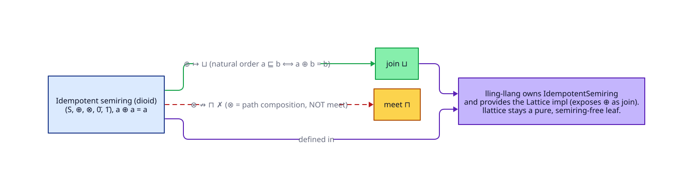

# The Semiring ↔ Lattice Bridge — and why it lives elsewhere

> **Prerequisite:** [02 — Semilattices and lattices](02-semilattices-lattices.md). Symbols in the
> [glossary](../GLOSSARY.md). This document explains a relationship `llattice` deliberately does **not**
> implement, and *why* that boundary is drawn where it is.

There is a precise, well-known bridge between **lattices** and **idempotent semirings**. Understanding it
explains a design decision: the bridge code lives in the sibling crate [`lling-llang`](https://github.com/vinary-tree/lling-llang),
never in `llattice`. This document makes the mathematics explicit so the boundary reads as principled, not
arbitrary.

---

## 1. Semirings and dioids

A **semiring** `(S, ⊕, ⊗, 0̄, 1̄)` is a set with two associative operations:

- `⊕` (**addition**), commutative, with identity `0̄`;
- `⊗` (**multiplication**), with identity `1̄`, distributing over `⊕` on both sides;
- `0̄` annihilates `⊗`: `0̄ ⊗ a = a ⊗ 0̄ = 0̄`.

Unlike a ring, there are **no additive inverses** — you cannot subtract. A semiring whose addition is
**idempotent** (`a ⊕ a = a` for all `a`) is called an **idempotent semiring** or **dioid**.

The motivating examples are the *path algebras*:

| Dioid | `⊕` | `⊗` | `0̄` | `1̄` | Use |
|-------|-----|-----|-----|-----|-----|
| tropical (min-plus) | `min` | `+` | `+∞` | `0` | shortest paths |
| max-plus | `max` | `+` | `−∞` | `0` | scheduling, longest paths |
| Boolean | `∨` | `∧` | `false` | `true` | reachability |
| Viterbi | `max` | `×` | `0` | `1` | most-likely path |

In each, `⊕` *selects among alternative paths* and `⊗` *composes along a path*.

---

## 2. Every idempotent semiring carries a join-semilattice — for free

This is the bridge, in one theorem.

### Theorem (natural order of a dioid)

Let `(S, ⊕, ⊗, 0̄, 1̄)` be an idempotent semiring. Define the **natural (canonical) order**

```text
a ⊑ b   :⟺   a ⊕ b = b.
```

Then `(S, ⊑)` is a join-semilattice whose join is `⊕` and whose least element is `0̄`.

### Proof

`⊕` is commutative, associative, and (by hypothesis) idempotent. By the converse direction of the connecting
theorem ([02 §3](02-semilattices-lattices.md#3-the-orderoperation-bridge)), any such operation defines a
partial order via `a ⊑ b :⟺ a ⊕ b = b`, under which `⊕` is the least upper bound. The additive identity `0̄`
satisfies `0̄ ⊕ a = a`, i.e. `0̄ ⊑ a` for all `a`, so `0̄ = ⊥`. ∎

> **So the bridge is real and one-directional-cheap:** *give me any idempotent semiring and I hand you a
> join-semilattice with `join = ⊕`.* This is exactly the `Lattice` impl that `lling-llang` provides for its
> semiring types.



---

## 3. Why multiplication is not meet

Having identified `⊕` with `⊔`, the seductive next step is to identify `⊗` with `⊓`. **This is a category
error**, and avoiding it is the reason the bridge is quarantined.

In a dioid, `⊗` is **path composition**, not greatest-lower-bound:

- In min-plus, `a ⊗ b = a + b` (concatenate edge weights), whereas `a ⊓ b` would be `max(a, b)` — different
  operations with different units and different algebra.
- `⊗` need not be idempotent (`a ⊗ a ≠ a` in general: `2 + 2 ≠ 2`), so it is not even a semilattice operation.
- `⊗` need not be commutative (matrix dioids, weighted automata), whereas `⊓` always is.

The correct reading: a dioid is a **join-semilattice `(S, ⊕)` enriched with a monoid `(S, ⊗, 1̄)` that
distributes over the join**. The `⊗` direction is orthogonal to the meet; conflating them silently corrupts
any shortest-path or weighted-automaton computation. (`liblevenshtein`'s automata and `lling-llang`'s WFSTs
depend on getting this exactly right.)

If a dioid *also* happens to be a lattice (has a genuine `⊓`), that meet is an additional structure, not `⊗`.

---

## 4. Why the bridge lives in `lling-llang`, not here

`llattice` is a **leaf crate**: it owns the `Lattice` vocabulary and nothing else (see
[design/01](../design/01-architecture.md)). The semiring↔lattice bridge requires *semiring types* —
`IdempotentSemiring`, the tropical/Viterbi instances, the `⊗` monoid. Those live in `lling-llang`. Placing the
bridge there, rather than in `llattice`, has three concrete payoffs:

1. **`llattice` stays dependency-free.** A crate that needs only the lattice vocabulary (say, a CRDT in
   `libdictenstein`) never pulls in semiring machinery it will not use.
2. **The orphan rule is respected without contortion.** `lling-llang` defines `IdempotentSemiring`, so it is
   allowed to write `impl<S: IdempotentSemiring> Lattice for S` — exposing `⊕` as `join` — because it owns the
   semiring trait. (See [design/02 — the orphan rule](../design/02-orphan-rule.md).)
3. **The category error is structurally impossible to make here.** Because `llattice` has no `⊗`, no one can
   accidentally wire `⊗` to `meet` in this crate. The dangerous identification can only be written where the
   semiring lives, under the eyes of code that understands path composition.

```text
   llattice  ──owns──▶  trait Lattice { join, meet }      (no ⊗ anywhere)
       ▲
       │ depends on
       │
   lling-llang  ──owns──▶  trait IdempotentSemiring { ⊕, ⊗, 0̄, 1̄ }
                ──provides──▶  impl Lattice for S  (join = ⊕;  meet is NOT ⊗)
```

---

## 5. Summary

- Every idempotent semiring has a **natural order** making `⊕` a `join` and `0̄` a `⊥` (a join-semilattice, for
  free).
- Its `⊗` is **path composition**, categorically distinct from `meet`; identifying them is a bug.
- Therefore the bridge belongs in the crate that owns the semiring types — `lling-llang` — keeping `llattice` a
  pure, dependency-free leaf and making the `⊗`/`⊓` confusion unrepresentable here.

→ Back to **[the theory index](../README.md#theory)**, or on to **[design/01 — architecture](../design/01-architecture.md)**.

---

## References

1. Gondran, M., & Minoux, M. (2008). *Graphs, Dioids and Semirings: New Models and Algorithms*. Springer.
   <https://doi.org/10.1007/978-0-387-75450-5> — the authoritative reference on dioids and their natural order.
2. Davey, B. A., & Priestley, H. A. (2002). *Introduction to Lattices and Order* (2nd ed.). Cambridge
   University Press. <https://doi.org/10.1017/CBO9780511809088> — the connecting lemma reused in §2.
